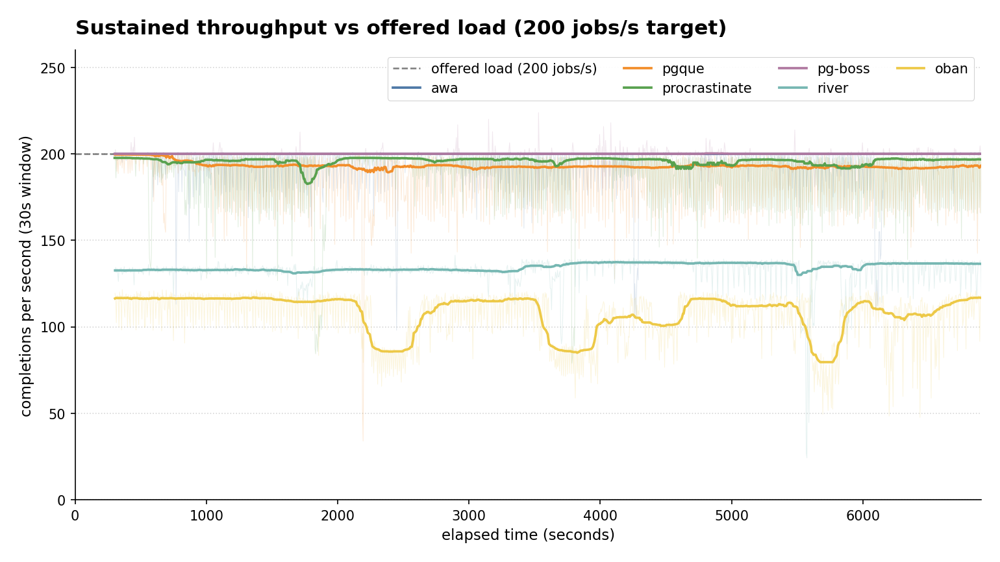
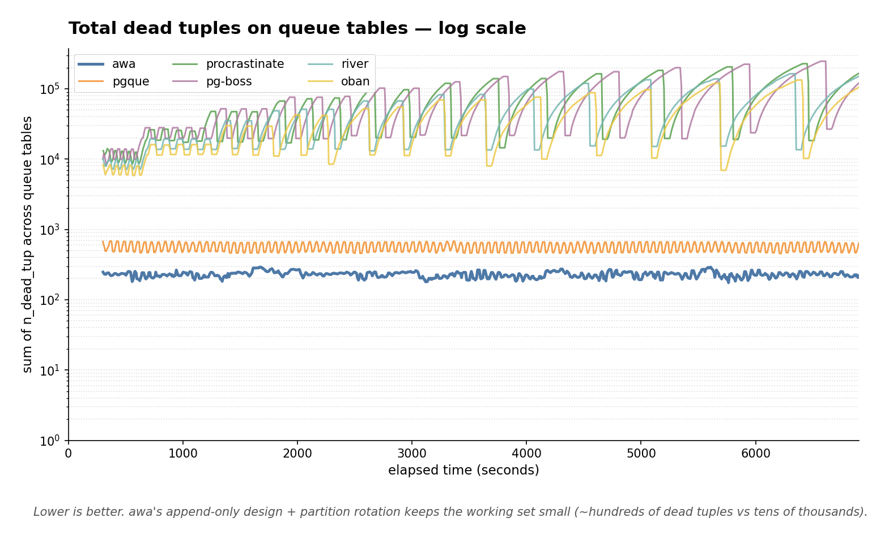
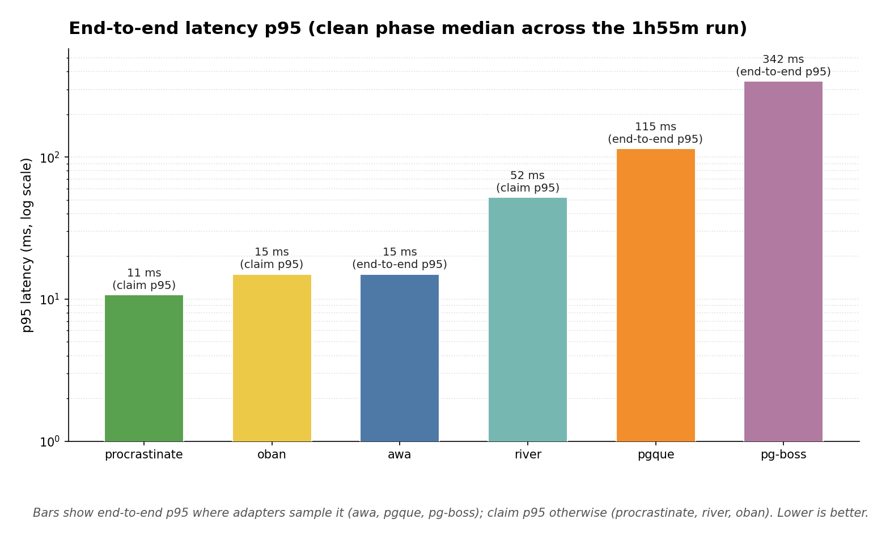
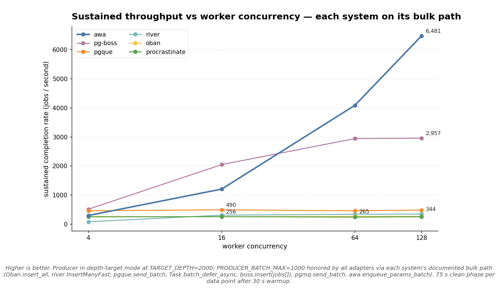
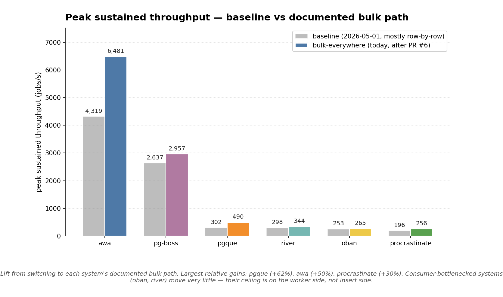

# postgresql-job-queue-benchmarking

A benchmarking harness for comparing PostgreSQL-backed job queue systems
under realistic, long-horizon workloads.

The goal is a **fair, reproducible, public-API-only** comparison of how
different queue libraries behave when you push them past warm-up — focusing
on the things that show up in production: latency tail, throughput stability,
table bloat, and recovery from chaos.











The first three plots are the headline view of the
[2026-04-28 long-horizon comparison](results/2026-04-28/SUMMARY.md):
six systems, 200 jobs/s offered load, 8 workers, 115 minutes of clean
steady-state. The fourth and fifth are from the
[2026-05-01 bulk-everywhere matrix](results/2026-05-01-bulk-everywhere/SUMMARY.md):
each system measured at 4 / 16 / 64 / 128 workers, with each adapter
routed through its system's documented bulk producer path
(`Oban.insert_all`, river `InsertManyFast`, `pgque.send_batch`,
`Task.batch_defer_async`, `boss.insert(jobs[])`, `pgmq.send_batch`,
awa `enqueue_params_batch`). The original
[row-by-row baseline](results/2026-05-01-worker-scaling/SUMMARY.md)
is preserved alongside for the comparison.

Per-system architectural notes and "when does this make sense" reads
are in [`SYSTEM_COMPARISONS.md`](SYSTEM_COMPARISONS.md). **Author bias: this
repo is owned by the author of [awa](https://github.com/hardbyte/awa),
one of the systems benchmarked. Numbers are reproducible — re-run on
your hardware and check.**

## Status

Bootstrapping. Currently includes adapters for:

- [Oban](https://github.com/oban-bg/oban) (Elixir)
- [pg-boss](https://github.com/timgit/pg-boss) (Node.js)
- [pgmq](https://github.com/tembo-io/pgmq) (Postgres extension; Python adapter)
- [PgQ](https://github.com/pgq/pgq) (Postgres extension; Python adapter)
- [Procrastinate](https://github.com/procrastinate-org/procrastinate) (Python)
- [River](https://github.com/riverqueue/river) (Go)

The [awa](https://github.com/hardbyte/awa) adapter (Rust + Python) is
pending — see [issue tracker](https://github.com/hardbyte/postgresql-job-queue-benchmarking/issues)
for the public-API refactor.

## Design principles

- **Public APIs only.** Each adapter integrates the system the way a real
  consumer would. No reaching into internal modules, no privileged SQL.
- **Subprocess contract.** Adapters are language-agnostic processes that
  emit one JSON sample per line on stdout. Adding a new system means
  writing one binary that respects the contract — see
  [CONTRIBUTING_ADAPTERS.md](./CONTRIBUTING_ADAPTERS.md).
- **One Postgres for everyone.** All systems run against the same
  `postgres:17.2-alpine` instance with the same `postgres.conf` — no
  per-system tuning advantage.
- **Long-horizon.** Bloat and latency drift only show up after the first
  few minutes. Default scenarios run 30+ minutes.

## Quick start

```sh
# Init the pgque submodule (vendored at a pinned upstream SHA)
git submodule update --init --recursive

# Bring up Postgres (port 15555 by default)
docker compose up -d postgres

# Run a 5-minute smoke against one system
uv run python long_horizon.py run \
  --systems procrastinate \
  --producer-rate 200 \
  --worker-count 4 \
  --replicas 1 \
  --phase warmup=warmup:30s \
  --phase clean=clean:5m
```

Outputs land under `results/<run-id>/<system>/` as `manifest.json` +
`summary.json` + per-sample `samples.ndjson`. To compare runs:

```sh
uv run python long_horizon.py compare results/<run-id>
```

## Scenarios

Each named scenario desugars to a phase sequence; pass `--scenario <name>`
to `long_horizon.py run`, or compose your own with `--phase
<label>=<type>:<duration>`.

### `long_horizon.py` scenarios

| Scenario | What it exercises |
|---|---|
| `idle_in_tx_saturation` | Steady-state baseline → an idle-in-transaction holder takes a writing tx with an XID assigned and pins the cluster xmin → recovery. The classic Postgres bloat trigger. Surfaces how a system holds up when autovacuum can't reclaim dead tuples. |
| `long_horizon` | Like `idle_in_tx_saturation` but longer, with a second idle-in-tx phase after recovery. Used for bloat-recovery soak studies. |
| `sustained_high_load` | Baseline → sustained 1.5× offered load → recovery. Tests whether the queue engine collapses or degrades gracefully when producers outpace workers. |
| `active_readers` | Baseline → 4 overlapping `REPEATABLE READ` connections running repeating scans against the queue's hot tables → recovery. Mirrors the analytics-on-OLTP pattern that pins MVCC horizon without an explicit idle-in-tx. |
| `event_delivery_matrix` | Balanced compare profile: clean → readers → high-load → recovery. The "broad shape comparison" scenario for cross-system dashboards. |
| `event_delivery_burst` | Burst / catch-up profile: clean → 45 min of high-load → 30 min recovery. Measures absorption + drain after a sustained oversupply of work. |
| `fleet_steady_state` | Multi-replica steady-state. Pair with `--replicas >= 2`. |
| `soak` | Warmup + 6 hours clean. Used to detect slow drift that shorter runs miss. |
| `crash_recovery` | Clean → SIGKILL replica 0 → restart → recovery. Pair with `--replicas >= 2` for a meaningful "fleet covers the kill" measurement; single-replica still works but the recovery phase just measures time-to-empty. |
| `crash_recovery_under_load` | `crash_recovery` with a high-load phase before the kill, so the fleet is already under backlog pressure. Pair with `--replicas >= 2`. |

### Phase types (compose your own)

| Phase type | What it does |
|---|---|
| `warmup` | Steady producer load for absorbing startup artifacts; samples are excluded from the summary. |
| `clean` | Steady-state baseline at the configured `--producer-rate`. |
| `high-load` | Steady producer load multiplied by `--high-load-multiplier` (default 1.5). |
| `idle-in-tx` | Opens one `BEGIN` + `SELECT txid_current()` connection that holds an XID for the whole phase. Simulates a long-running writing transaction (held xmin → vacuum starvation). |
| `active-readers` | Opens N (default 4, set via `ACTIVE_READER_COUNT`) `REPEATABLE READ` connections doing repeating scans against the adapter's hot tables. Simulates analytics readers on the OLTP path. |
| `recovery` | Producer load drops to baseline; the bench measures how the system catches up after a stress phase. |
| `kill-worker(instance=N)` | SIGKILLs replica N and waits for the configured duration. Used inside `crash_recovery` scenarios. |
| `start-worker(instance=N)` | Restarts a previously killed replica and watches for re-registration. |

### `chaos.py` scenarios

`chaos.py` is the correctness-under-adversity comparison runner (separate
from `long_horizon.py` because it issues SIGKILLs and Postgres restarts
that are incompatible with throughput sampling).

| Scenario | What it exercises |
|---|---|
| `crash_recovery` | SIGKILL the worker mid-flight; verify all enqueued jobs eventually complete after restart with no loss and no duplicates. |
| `postgres_restart` | Stop and restart the Postgres container while jobs are in flight; verify reconnect + no loss. |
| `repeated_kills` | SIGKILL the worker repeatedly during a sustained run; verify cumulative no-loss. |
| `pg_backend_kill` | `pg_terminate_backend` the worker's session repeatedly; verify reconnect path. |
| `leader_failover` | Force leader election by killing the current leader; verify maintenance work continues. |
| `pool_exhaustion` | Saturate the worker's connection pool and verify it recovers without hanging. |
| `retry_storm` | Drive a high concurrent retry rate; verify no duplicate completions. |
| `priority_starvation` | Mix high- and low-priority work; verify low priority eventually runs (priority aging). |

## Repo layout

```
bench_harness/        # orchestrator, sample contract, comparison/plot
                      # tooling — independent of any specific SUT
tests/                # pytest suite for the harness itself
<system>-bench/       # one directory per system-under-test, each
                      # producing a binary that talks the JSON contract
docker-compose.yml    # shared Postgres + sidecars
postgres.conf         # shared tuning (work_mem, autovacuum, etc.)
long_horizon.py       # main CLI: run | combine | compare
```

## Contributing a system

See [CONTRIBUTING_ADAPTERS.md](./CONTRIBUTING_ADAPTERS.md) for the JSON
contract and an end-to-end walk-through.

## License

MIT — see [LICENSE](./LICENSE).
