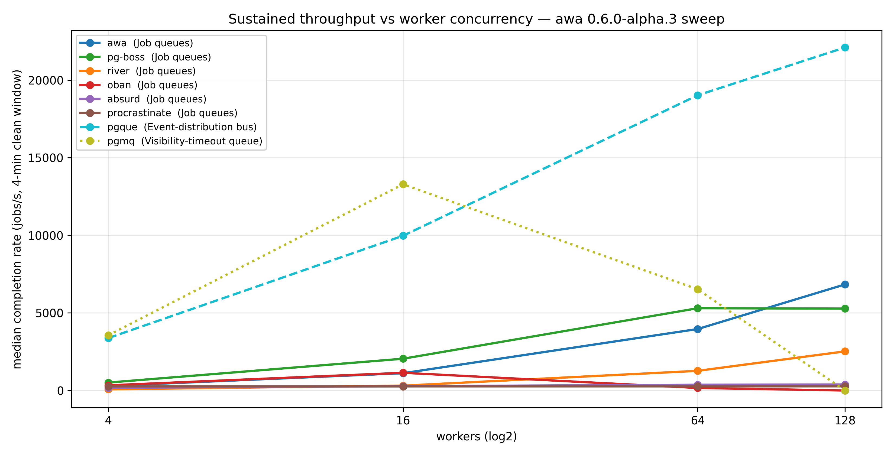

# postgresql-job-queue-benchmarking

A benchmarking harness for comparing PostgreSQL-backed job queue systems
under realistic, long-horizon workloads.

The goal is a **fair, reproducible, public-API-only** comparison of how
different queue libraries behave when you push them past warm-up — focusing
on the things that show up in production: latency tail, throughput stability,
table bloat, and recovery from chaos.

## Feature comparison

Throughput is one shape of the question. The other shape is **what
each system actually gives you**. This table captures the documented
feature surface — things you'd reach for in real applications. Cells
reflect what's available out of the box on the default open-source
distribution.

| | awa | Absurd | pg-boss | pgmq | pgque | Oban | Procrastinate | River |
|---|:-:|:-:|:-:|:-:|:-:|:-:|:-:|:-:|
| **Language / runtime** | Rust + Python | Python | Node.js | Postgres extension (Rust core) | Postgres extension (PL/pgSQL) | Elixir | Python | Go |
| **Postgres extension required** | no | no | no | yes (`pgmq`) | yes (`pgque`) | no | no | no |
| **Producer surface — bulk insert** | ✓ | — | ✓ | ✓ | ✓ | ✓ | ✓ | ✓ (COPY) |
| **Storage shape on hot path** | append-only + receipt ring | row-mutating | row-mutating | partitioned archive | append-only + ticker | row-mutating | row-mutating | row-mutating |
| **Priorities** | ✓ (with aging) | — | ✓ | — | — | ✓ | ✓ | ✓ |
| **Retries with backoff** | ✓ | ✓ | ✓ | (visibility timeout) | ✓ | ✓ | ✓ | ✓ |
| **Cron / scheduled jobs** | ✓ | — | ✓ | — | (delayed) | ✓ | ✓ | ✓ |
| **Dead-letter queue** | ✓ | — | (failed-archive) | (archive table) | ✓ | (discarded) | (discarded) | ✓ |
| **Unique jobs / dedup** | ✓ | — | ✓ (singleton key) | — | — | ✓ | ✓ | ✓ |
| **Rate limiting per queue** | ✓ | — | ✓ (throttling) | — | — | ✓ (Pro for global) | (concurrency limit) | ✓ |
| **Callbacks / external waits** | ✓ | (workflow steps) | (event subscription) | — | — | — | — | — |
| **Mixed-runtime workers** | ✓ (Rust + Python) | — | — | (DIY worker) | (DIY worker) | — | — | — |
| **Web UI for ops** | ✓ (`awa serve`) | — | (3rd party: pgboss-dashboard) | — | — | ✓ (Oban Web, Pro) | (3rd party) | ✓ |

Dashes indicate "not provided as a documented feature out of the box",
not "impossible". pgmq / pgque in particular are intentionally minimal
— you build the worker, you choose the lifecycle. If you spot
something wrong, please open a PR — corrections welcome from the
maintainers of any of the systems listed.

## Throughput



From the
[2026-05-02 alpha.3 sweep](results/2026-05-02-alpha3-sweep/SUMMARY.md):
eight systems measured at 4 / 16 / 64 / 128 workers, each routed
through its documented bulk producer path. The plot uses linestyles to
group systems by category — the rows below are not a single ranked
table.

### Three shapes of system

The systems benchmarked here aren't all the same shape. Comparing peak
jobs/s across categories is comparing different work, so the headline
peaks split three ways:

**Job queues** — per-job lifecycle (claim → run → complete | retry |
fail | DLQ), per-job retries with backoff, scheduled / priority jobs,
DLQ. Throughput between members of this group means the same thing.

| System | Peak (jobs/s) | At |
|---|---:|---|
| **awa** | **6,834** | 1×128 w |
| **pg-boss** | 5,302 | 1×64 w |
| **river** | 2,522 | 1×128 w |
| **oban** | 1,142 | 1×16 w |
| **absurd** | 388 | 1×128 w |
| **procrastinate** | 270 | flat |

**Visibility-timeout queue** — pgmq is SQS-shaped: send, read with
timeout, ack-or-redeliver. No per-job retry counter, no scheduling,
you bring the worker. Comparable to a job queue on raw throughput
only if your real workload doesn't need framework features.

| System | Peak (jobs/s) | At |
|---|---:|---|
| **pgmq** | 13,290 | 1×16 w |

**Event-distribution bus** — pgque (PgQ lineage) appends events to a
log; a coordinator builds *batches* on a ticker; consumer groups pull
a whole batch at a time and ack the batch, not individual events.
The throughput it shows is the SQL ceiling for batched ingest-and-ack
on Postgres, not "queue speed" the way it means for a job queue.

| System | Peak (jobs/s) | At |
|---|---:|---|
| **pgque** | 22,104 | 1×128 w |

So if you skim the plot and see pgque sitting comfortably above
everything else: yes, on its own metric, but the work it's doing per
"job" is thinner. Pick the system whose category matches your actual
problem first; *then* look at the number inside that category.

Architectural notes and "when does this make sense" per-system reads
are in [`SYSTEM_COMPARISONS.md`](SYSTEM_COMPARISONS.md).

Other reference runs:
- [2026-05-02 alpha.3 sweep](results/2026-05-02-alpha3-sweep/SUMMARY.md)
  — the matrix plotted above plus a 60-min awa soak (sustained 5.4 k
  jobs/s, dead-tuple median 396 across an hour) and three multi-replica
  chaos topologies. Includes phase-banded charts of all 8 systems
  going through warmup → baseline → pressure → kill → restart →
  recovery.
- [awa under a 10-minute held writing transaction](results/2026-05-01-awa-longtx-pg-ash/SUMMARY.md)
  with postgres-side wait-event sampling — what actually limits awa
  (spoiler: WAL fsync, not lock contention)
- [awa extended scaling](results/2026-05-01-awa-extended-scaling/SUMMARY.md)
  — awa pushed to 256 / 512 / 1024 workers
- [pgmq on `quay.io/tembo/pg17-pgmq`](results/2026-05-02-pgmq-extension-image/SUMMARY.md)
  — pgmq's first published numbers in this repo

**Author bias:** this repo is owned by the author of
[awa](https://github.com/hardbyte/awa), one of the systems benchmarked.
Numbers are reproducible — re-run on your hardware and check.

## Chaos / correctness

Chaos scenarios run inside the same `bench.py` harness as
every other workload, as named compositions of phase types. The
sample-stream metrics, wait-event histograms, and per-phase
aggregates the steady-state runs produce all carry over; in
addition the harness derives `jobs_lost` (cumulative
`enqueue_rate − completion_rate` across the chaos and recovery
phases) and `chaos_recovery_time_s` (time from end of chaos until
completion rate re-attains 90% of baseline median) and writes them
into `summary.json` for the recovery phase. Published so far:

- [awa under crash_recovery](results/2026-05-02-awa-crash-recovery/SUMMARY.md)
  — replica 0 SIGKILLed mid-run; throughput stays in the 400-480
  jobs/s band across all five phases (baseline / pressure / kill /
  restart / recovery), wait-event profile invariant.

Available chaos scenarios:

| Scenario | What it exercises |
|---|---|
| `chaos_crash_recovery` | Kill replica 0, restart, recover. Pair with `--replicas >= 2`. |
| `chaos_postgres_restart` | Stop and restart Postgres mid-run; verify reconnect + completion. |
| `chaos_repeated_kills` | Periodic SIGKILL+restart of replica 0; cumulative no-loss. |
| `chaos_pg_backend_kill` | `pg_terminate_backend` of the SUT's backends at fixed rate. |
| `chaos_pool_exhaustion` | Hold N idle connections to verify SUT survives pool pressure. |

The legacy `chaos.py` runner is deprecated and kept only as a
reference for `leader_failover`, `retry_storm`, and
`priority_starvation` — those are system-specific and not yet
folded in. The full cross-system chaos picture is tracked under
[#12](https://github.com/hardbyte/postgresql-job-queue-benchmarking/issues/12);
the runner consolidation lands in
[#13](https://github.com/hardbyte/postgresql-job-queue-benchmarking/issues/13).

## Adapters

- [awa](https://github.com/hardbyte/awa) (Rust + Python) — tracking 0.6.0-alpha.3
- [Absurd](https://github.com/earendil-works/absurd) (Python)
- [Oban](https://github.com/oban-bg/oban) (Elixir)
- [pg-boss](https://github.com/timgit/pg-boss) (Node.js)
- [pgmq](https://github.com/tembo-io/pgmq) (Postgres extension; Python adapter; needs an extension-bearing image, run separately from the shared-image matrix)
- [PgQ](https://github.com/pgq/pgq) (Postgres extension; Python adapter)
- [Procrastinate](https://github.com/procrastinate-org/procrastinate) (Python)
- [River](https://github.com/riverqueue/river) (Go)

## Design principles

- **Public APIs only.** Each adapter integrates the system the way a real
  consumer would. No reaching into internal modules, no privileged SQL.
- **Subprocess contract.** Adapters are language-agnostic processes that
  emit one JSON sample per line on stdout. Adding a new system means
  writing one binary that respects the contract — see
  [CONTRIBUTING_ADAPTERS.md](./CONTRIBUTING_ADAPTERS.md).
- **One Postgres for everyone.** All systems run against the same
  `postgres:17.2-alpine` instance with the same `postgres.conf` — no
  per-system tuning advantage.
- **Long-horizon.** Bloat and latency drift only show up after the first
  few minutes. Default scenarios run 30+ minutes.

## Quick start

```sh
# Init the pgque submodule (vendored at a pinned upstream SHA)
git submodule update --init --recursive

# Bring up Postgres (port 15555 by default)
docker compose up -d postgres

# Run a 5-minute smoke against one system
uv run bench run \
  --systems procrastinate \
  --producer-rate 200 \
  --worker-count 4 \
  --replicas 1 \
  --phase warmup=warmup:30s \
  --phase clean=clean:5m
```

Outputs land under `results/<run-id>/<system>/` as `manifest.json` +
`summary.json` + per-sample `samples.ndjson`. To compare runs:

```sh
uv run bench compare results/<run-id>
```

## Scenarios

Each named scenario desugars to a phase sequence; pass `--scenario <name>`
to `bench.py run`, or compose your own with `--phase
<label>=<type>:<duration>`.

### `bench.py` scenarios

| Scenario | What it exercises |
|---|---|
| `idle_in_tx_saturation` | Steady-state baseline → an idle-in-transaction holder takes a writing tx with an XID assigned and pins the cluster xmin → recovery. The classic Postgres bloat trigger. Surfaces how a system holds up when autovacuum can't reclaim dead tuples. |
| `long_horizon` | Like `idle_in_tx_saturation` but longer, with a second idle-in-tx phase after recovery. Used for bloat-recovery soak studies. |
| `sustained_high_load` | Baseline → sustained 1.5× offered load → recovery. Tests whether the queue engine collapses or degrades gracefully when producers outpace workers. |
| `active_readers` | Baseline → 4 overlapping `REPEATABLE READ` connections running repeating scans against the queue's hot tables → recovery. Mirrors the analytics-on-OLTP pattern that pins MVCC horizon without an explicit idle-in-tx. |
| `event_delivery_matrix` | Balanced compare profile: clean → readers → high-load → recovery. The "broad shape comparison" scenario for cross-system dashboards. |
| `event_delivery_burst` | Burst / catch-up profile: clean → 45 min of high-load → 30 min recovery. Measures absorption + drain after a sustained oversupply of work. |
| `fleet_steady_state` | Multi-replica steady-state. Pair with `--replicas >= 2`. |
| `soak` | Warmup + 6 hours clean. Used to detect slow drift that shorter runs miss. |
| `crash_recovery` | Clean → SIGKILL replica 0 → restart → recovery. Pair with `--replicas >= 2` for a meaningful "fleet covers the kill" measurement; single-replica still works but the recovery phase just measures time-to-empty. |
| `crash_recovery_under_load` | `crash_recovery` with a high-load phase before the kill, so the fleet is already under backlog pressure. Pair with `--replicas >= 2`. |
| `chaos_crash_recovery` | Warmup → baseline → SIGKILL replica 0 → restart → recovery. Aggregates `jobs_lost` and `chaos_recovery_time_s` into `summary.json`. |
| `chaos_postgres_restart` | Stop + start the Postgres container mid-run; SUT must reconnect and drain. |
| `chaos_repeated_kills` | Periodic SIGKILL+restart of replica 0 across a sustained chaos phase. |
| `chaos_pg_backend_kill` | Steady stream of `pg_terminate_backend` against the SUT's connections. |
| `chaos_pool_exhaustion` | Hold 300 idle connections to pressure the SUT's pool sizing. |

### Phase types (compose your own)

| Phase type | What it does |
|---|---|
| `warmup` | Steady producer load for absorbing startup artifacts; samples are excluded from the summary. |
| `clean` | Steady-state baseline at the configured `--producer-rate`. |
| `high-load` | Steady producer load multiplied by `--high-load-multiplier` (default 1.5). |
| `idle-in-tx` | Opens one `BEGIN` + `SELECT txid_current()` connection that holds an XID for the whole phase. Simulates a long-running writing transaction (held xmin → vacuum starvation). |
| `active-readers` | Opens N (default 4, set via `ACTIVE_READER_COUNT`) `REPEATABLE READ` connections doing repeating scans against the adapter's hot tables. Simulates analytics readers on the OLTP path. |
| `recovery` | Producer load drops to baseline; the bench measures how the system catches up after a stress phase. |
| `kill-worker(instance=N)` | SIGKILLs replica N and waits for the configured duration. Used inside `crash_recovery` scenarios. |
| `start-worker(instance=N)` | Restarts a previously killed replica and watches for re-registration. |
| `postgres-restart` | `docker compose stop postgres` for half the duration, then `start` for the rest. Drives the harness-managed compose lifecycle. |
| `pg-backend-kill(rate=N)` | Opens an admin connection that runs `pg_terminate_backend(pid)` against the SUT's database `N` times per second. |
| `pool-exhaustion(idle_conns=N)` | Holds `N` idle connections against the SUT's database for the duration; releases them on phase end. |
| `repeated-kill(instance=I,period=Ns)` | Periodic SIGKILL + auto-restart of replica `I` every `period`. Composes `kill-worker` / `start-worker`. |

### `chaos.py` (deprecated)

`chaos.py` was the standalone chaos comparison runner. Its
scenarios have been folded into `bench.py` as named phase
compositions (see the `chaos_*` rows above and the `kill-worker`,
`postgres-restart`, `pg-backend-kill`, `pool-exhaustion`, and
`repeated-kill` phase types). The script is retained in the repo
as a reference for `leader_failover`, `retry_storm`, and
`priority_starvation` — those scenarios are system-specific and
have not yet been migrated. New chaos measurements should go
through `bench.py run --scenario chaos_*`.

## Wait-event sampling

Throughput, latency, and bloat answer *that* one system is slower than
another. **Wait events** answer *why* — the postgres-side reason a
system is bottlenecked, not just whether it is. The harness samples
`pg_stat_activity` once per second from a dedicated connection and
aggregates non-idle backend snapshots into a per-phase histogram of
`(wait_event_type, wait_event)`. Same shape as
[pg_ash](https://github.com/NikolayS/pg_ash) produces, implemented
inside the harness so we don't have to swap the postgres image.

Output lands in `raw.csv` (`subject_kind=wait_event`), `summary.json`
(top-10 events per phase plus `total_active_samples`), and a stacked
bar plot per system in `index.html`. On by default at 1 s cadence;
opt out with `--no-wait-events` or tune via
`--wait-event-sample-every <seconds>`. Primer with the common event
types and how to read the stack: [`docs/wait-events.md`](docs/wait-events.md).

## Repo layout

```
bench_harness/        # orchestrator, sample contract, comparison/plot
                      # tooling — independent of any specific SUT
tests/                # pytest suite for the harness itself
<system>-bench/       # one directory per system-under-test, each
                      # producing a binary that talks the JSON contract
docker-compose.yml    # shared Postgres + sidecars
postgres.conf         # shared tuning (work_mem, autovacuum, etc.)
bench.py              # main CLI: run | combine | compare
```

## Contributing a system

See [CONTRIBUTING_ADAPTERS.md](./CONTRIBUTING_ADAPTERS.md) for the JSON
contract and an end-to-end walk-through.

## License

MIT — see [LICENSE](./LICENSE).
