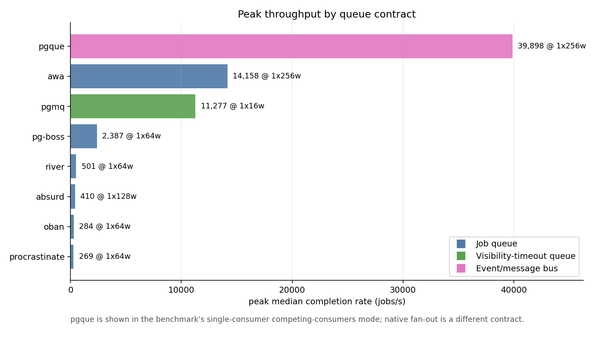
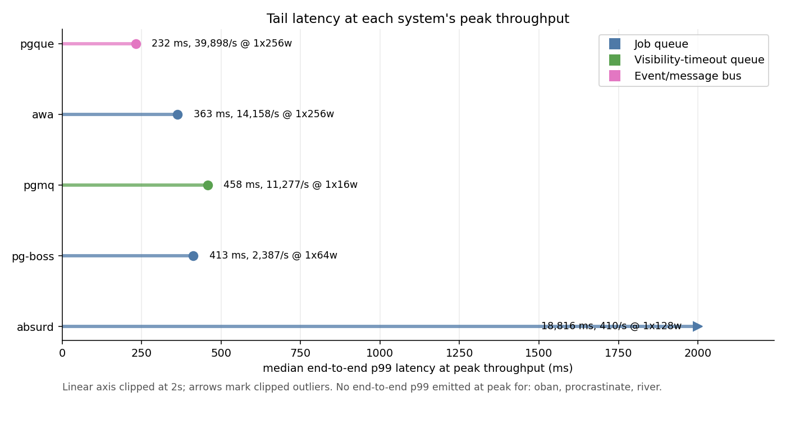

# postgresql-job-queue-benchmarking

Benchmarking harnesses for two families of PostgreSQL-backed infrastructure:

- **[Job queues](#the-job-queue-bench)** — eight Postgres-backed queue systems compared on throughput, latency tail, bloat, and chaos recovery.
- **[Change data capture](#the-cdc-bench)** — six CDC pipeline topologies (Debezium, Sequin, Supabase ETL, raw pgoutput, Kafka) compared on fan-out latency, WAL insulation from bad consumers, and recovery behaviour.

Both share the same philosophy: **fair, reproducible, public-API-only**. Each system is integrated the way a real consumer would use it, pinned to specific versions, run against the same pinned Postgres, and pushed past warm-up into the long-horizon territory where production failure modes actually appear — latency drift, table bloat, WAL retention, duplicate storms, recovery from chaos.

**Author bias:** this repo is owned by the author of [awa](https://github.com/hardbyte/awa), one of the job-queue systems benchmarked. Numbers are reproducible — re-run on your hardware and check.

---

## The job-queue bench

A closed-loop harness: producers enqueue at a controlled rate, workers claim and complete, the harness measures the loop under steady state, sustained pressure, and chaos.

### What the latest run found

Eight Postgres-backed queues, same hardware, same harness. Three contracts in the lineup — event bus, job queue, visibility-timeout queue — so the throughput list isn't a single ranking. The [2026-05-09 sweep](results/2026-05-09-full-sweep/SUMMARY.md) has the per-cell numbers, chaos behaviour, and bloat resistance.





| System | Contract | Peak (jobs/s) | Chaos recovery | Pressure cells | Notable caveat |
|---|---|---:|---:|---:|---|
| **pgque** *(single-consumer mode)* | event bus | **39,898** | 5/5 | 4/4 | Batched success ack is a different contract (see below). |
| **awa** | job queue | **14,158** | 5/5 | 4/4 | Full job-queue feature surface; fastest job queue in this run. |
| pgmq | visibility-timeout | 11,277 | 3/5 | 2/4 | Anti-scales past 16 workers; active-readers cliff ([audit](results/2026-05-09-full-sweep/audit_pgmq.md)). |
| pg-boss | job queue | 2,387 | 3/5 | 2/4 | Postgres-level chaos exits the worker; times out in two pressure cells. |
| river | job queue | 501 | 5/5 | 2/4 | Times out in two sustained-pressure cells. |
| absurd | job queue | 410 | 3/5 | 2/4 | Shutdown timeout under pressure. |
| oban | job queue | 284 | 4/5 | 4/4 | Handles pressure cells; lower throughput in this run. |
| procrastinate | job queue | 269 | 3/5 | 2/4 | Weak repeated-kill recovery; times out in two pressure cells. |

Three systems (awa, pgque, river) recover from every chaos scenario; the other five hit zero or produce no recovery samples in at least one cell. Only awa, oban, and pgque complete all four sustained-pressure scenarios.

### The three contracts

**Job queues** — send a job, a worker runs it, the queue tracks retries and dead-lettering: awa, pg-boss, river, oban, absurd, procrastinate.

**Visibility-timeout queue** — pgmq. Send / read with timeout / ack-or-redeliver. No per-job retry counter, no scheduling, no DLQ beyond an archive table.

**Event/message bus** — pgque (PgQ lineage). Append-only event log, ticker forms batch boundaries, multiple consumer groups each track a cursor over the shared log. This bench drives it in single-consumer competing-consumers mode: `receive` returns a batch and `ack(batch_id)` finishes the batch in one row update; failure handling stays per-message via `nack`. Cheap idempotent events are comfortable with that; long-running side-effecting jobs prefer the per-job ack the six job queues give you.

### Feature comparison

Throughput is one shape of the question; the other is what each system actually gives you out of the box. Cells reflect the documented feature surface of the default open-source distribution.

| | awa | Absurd | pg-boss | pgmq | pgque | Oban | Procrastinate | River |
|---|:-:|:-:|:-:|:-:|:-:|:-:|:-:|:-:|
| **Language / runtime** | Rust + Python | Python | Node.js | Postgres extension (Rust core) | Postgres extension (PL/pgSQL) | Elixir | Python | Go |
| **Postgres extension required** | no | no | no | yes[^pgmq-extension] | optional[^pgque-cron] | no | no | no |
| **Producer surface — bulk insert** | ✓ | — | ✓ | ✓ | ✓ | ✓ | ✓ | ✓[^river-copy] |
| **Storage shape on hot path** | append-only + receipt ring | row-mutating | row-mutating | partitioned archive | append-only + ticker | row-mutating | row-mutating | row-mutating |
| **Priorities** | ✓[^awa-priority-aging] | — | ✓ | — | — | ✓ | ✓ | ✓ |
| **Retries with backoff** | ✓ | ✓ | ✓ | ✓[^pgmq-vt] | ✓ | ✓ | ✓ | ✓ |
| **Cron / scheduled jobs** | ✓ | — | ✓ | — | ✓[^pgque-delayed] | ✓ | ✓ | ✓ |
| **Dead-letter queue** | ✓[^awa-dlq] | — | ✓[^pgboss-failed-archive] | ✓[^pgmq-archive] | ✓ | ✓[^discarded-state] | ✓[^discarded-state] | ✓ |
| **Unique jobs / dedup** | ✓ | — | ✓[^pgboss-singleton] | — | — | ✓ | ✓ | ✓ |
| **Rate limiting per queue** | ✓ | — | ✓[^pgboss-throttling] | — | — | ✓[^oban-pro-rate-limit] | ✓[^procrastinate-concurrency] | ✓ |
| **Callbacks / external waits** | ✓ | ✓[^absurd-workflow-steps] | ✓[^pgboss-events] | — | — | — | — | — |
| **Web UI for ops** | ✓[^awa-serve] | — | —[^pgboss-dashboard] | — | — | —[^oban-web] | —[^procrastinate-third-party-ui] | ✓ |

[^pgmq-extension]: pgmq can also be installed as SQL, but the benchmark and the common packaged distribution use the `pgmq` Postgres extension.
[^pgque-cron]: pgque itself is PL/pgSQL. `pg_cron` is needed for the convenience `pgque.start()` ticker; callers may drive the ticker themselves instead.
[^river-copy]: River's fast bulk path uses the Postgres `COPY` protocol.
[^awa-priority-aging]: awa priorities include aging so lower-priority work is eventually promoted.
[^pgmq-vt]: pgmq is a visibility-timeout queue: redelivery is controlled by the visibility timeout rather than a job-framework retry policy with counted attempts and backoff.
[^pgque-delayed]: pgque supports delayed visibility, but not cron-style periodic scheduling.
[^awa-dlq]: awa DLQ routing is opt-in via `dlq_enabled_by_default` or a per-queue override.
[^pgboss-failed-archive]: pg-boss keeps failed/expired job history rather than exposing a separate DLQ queue abstraction.
[^pgmq-archive]: pgmq archives messages into queue-specific archive tables; that is retention/replay storage rather than a job-framework DLQ policy.
[^discarded-state]: Oban and Procrastinate retain exhausted failures in discarded/failed states rather than moving them to a separate queue table.
[^pgboss-singleton]: pg-boss deduplication is expressed through singleton keys and singleton windows.
[^pgboss-throttling]: pg-boss rate limiting is exposed as throttling.
[^oban-pro-rate-limit]: Oban OSS supports local queue limits; global rate limiting is an Oban Pro feature.
[^procrastinate-concurrency]: Procrastinate can limit concurrency with locks/queueing policy, but does not expose a named per-queue rate-limit primitive.
[^absurd-workflow-steps]: Absurd models external waits as durable workflow steps rather than queue-level callbacks.
[^pgboss-events]: pg-boss exposes job lifecycle events/subscriptions rather than durable external-wait callbacks.
[^awa-serve]: awa includes the `awa serve` ops UI.
[^pgboss-dashboard]: pg-boss has third-party dashboards such as `pgboss-dashboard`, not an official bundled UI.
[^oban-web]: Oban Web is part of Oban Pro.
[^procrastinate-third-party-ui]: Procrastinate has community/third-party admin surfaces rather than a bundled official UI.

Dashes indicate "not provided as a documented feature out of the box", not "impossible" — pgmq and pgque are intentionally minimal. Corrections welcome from the maintainers of any system listed.

### Quick start (job queues)

```sh
# Init the pgque submodule (vendored at a pinned upstream SHA)
git submodule update --init --recursive

# Bring up Postgres (port 15555 by default)
docker compose up -d postgres

# Run a 5-minute smoke against one system
uv run bench run \
  --systems procrastinate \
  --producer-rate 200 \
  --worker-count 4 \
  --replicas 1 \
  --phase warmup=warmup:30s \
  --phase clean=clean:5m

# Compare runs
uv run bench compare results/<run-id>
```

Scenarios, phase types, chaos definitions, and Postgres-side diagnostics are in [`docs/method.md`](docs/method.md). Earlier reference runs: [awa vs pgque deep-dive](results/2026-05-08-awa-pgque-comparison-v2/SUMMARY.md) · [alpha.3 sweep](results/2026-05-02-alpha3-sweep/SUMMARY.md) · [awa under a 10-minute held transaction](results/2026-05-01-awa-longtx-pg-ash/SUMMARY.md) · [awa extended scaling](results/2026-05-01-awa-extended-scaling/SUMMARY.md).

---

## The CDC bench

An open-pipeline harness: a load generator writes a verifiable change stream into Postgres, a CDC system captures it from the logical WAL, and a harness-owned receiver terminates every consumer's delivery — timestamping arrivals, injecting chaos (dead/slow consumers, sink outages), and verifying the stream against a source-side ledger.

The model under test is **fan-out**: one source database, one change stream, many downstream consumers — some slow, dead, or misbehaving. The core question is *what a bad consumer costs the source database*, and what each architecture's insulation layer buys and costs:

```
loadgen ──SQL──▶ Postgres ──WAL──▶ capture ──▶ [insulation layer] ──▶ consumer 1..N
(harness)        (shared)          (SUT)        (SUT: Kafka /          (harness
                                                 internal buffer /      receiver ×N)
                                                 nothing)
```

### The six arms

| `--system` | Topology | Slots for N consumers | What it is |
|---|---|---:|---|
| `pgoutput-raw` | slot-per-consumer | N | in-repo SQL-polling pgoutput baseline, no insulation |
| `debezium-server` | slot-per-consumer | N | one Debezium Server (JVM) per consumer, batched HTTP sink |
| `supabase-etl` | slot-per-consumer | N | in-repo Rust binary embedding the [supabase/etl](https://github.com/supabase/etl) crate |
| `sequin` | shared slot + buffer | 1 | [Sequin](https://github.com/sequinstream/sequin) + Redis; per-sink cursors over its own buffer |
| `sequin-grouped` | shared slot + buffer | 1 | Sequin with `message_grouping` (documented per-PK ordering) |
| `debezium-kafka` | broker | 1 | Debezium Kafka Connect → Kafka; fan-out at the consumer-group layer |

### What the sweeps found

Full write-ups: [full-scale events sweep](results/cdc-sweep-long/SUMMARY.md) (15-minute outage) · [heterogeneous-profile sweep](results/cdc-sweep-hetero/SUMMARY.md) (mixed consumer speeds) · [ledger consistency sweep](results/cdc-sweep-ledger/REPORT.md).


**Correctness:** every sweep cell passes ledger verification — zero lost events on every consumer of every system, through 15-minute consumer outages, for all six arms. Cross-table transaction integrity and balance conservation hold everywhere. The one behavioural difference: Sequin replays a recovered consumer's backlog out of per-key order (tens of thousands of reordered redeliveries; `message_grouping` didn't change it in v0.14.6) — at-least-once with reordering, where every other arm recovers with zero duplicates and zero reordering.

**Where a dead consumer's backlog lives** (15-minute outage at 200 events/s):

| Topology | Source slot WAL | Backlog elsewhere |
|---|---:|---|
| slot-per-consumer | ~57 MB, all pinned by the dead consumer's own slot | — |
| shared slot + buffer (Sequin) | **642–680 MB** on the one slot every sink shares | its own state store |
| broker (Kafka) | **flat ~11 MB** | 179k records of consumer-group offset lag |

**Replay asymmetry:** after the consumer heals, slot- and broker-based arms drain the 15-minute backlog in **seconds** (18–36k events/s replay); Sequin's buffer takes **~9 minutes**, and the grouped variant longer still. Recovery-time-to-parity is currently the sharpest differentiator in the lineup.

**Latency insulation is the mirror image of WAL insulation.** With a mixed fleet (fast/normal/slow consumers), the slot-per-consumer and broker arms give each consumer the latency of its own speed — the slow consumer queues behind its own handling, the fast consumer is untouched. Sequin's buffer absorbs the slow sink entirely (a flat 33 ms p99 for every profile): the best steady-state mixed-fleet latency, from the same buffering that couples WAL retention to the slowest sink and replays slowly after an outage.

**Steady-state ladder** (200 events/s, worst-consumer median rolling p99): supabase-etl 26 ms < sequin 33 ms < pgoutput-raw 70 ms < debezium-server ~850 ms < debezium-kafka ~960 ms. Memory spans 13 MB (supabase-etl) to ~1.7 GB (the JVM arms).

### Quick start (CDC)

```sh
# End-to-end smoke: loadgen → Postgres → pgoutput → receiver, with a
# dead-consumer chaos phase and ledger verification (~90 s; needs docker + cargo)
uv run cdc --system pgoutput-raw --scenario smoke --rate 100

# Any other arm (images are pulled on first use)
uv run cdc --system sequin --scenario smoke --rate 100 --drain-timeout-s 120

# A sweep: all six arms × {fanout_steady, dead_consumer}, then a report
bash scripts/cdc_sweep.sh results/my-sweep
uv run python scripts/cdc_sweep_report.py results/my-sweep > results/my-sweep/REPORT.md
```

Workload modes: `--mode events` (single table), `ledger` (cross-table transfers, balance conservation), `outbox` (transactional outbox with janitor deletes). Chaos phases cover dead/slow consumers, sink outages, giant transactions, mid-stream DDL, and slot invalidation. [`docs/cdc-harness-design.md`](docs/cdc-harness-design.md) has the architecture and rationale; [`docs/cdc-sut-notes.md`](docs/cdc-sut-notes.md) has per-system integration facts, the verifier's design principles, and remaining gaps.

---

## Design principles (both benches)

- **Public APIs only.** Each adapter integrates the system the way a real consumer would. No reaching into internal modules, no privileged SQL.
- **Subprocess contract.** Adapters are language-agnostic processes that emit one JSON sample per line on stdout. Adding a system means writing one binary that respects the contract — see [CONTRIBUTING_ADAPTERS.md](./CONTRIBUTING_ADAPTERS.md).
- **One Postgres for everyone.** All systems run against the same `postgres:18.3-alpine` instance with the same `postgres.conf` (the CDC bench adds a logical-WAL overlay, `docker-compose.cdc.yml`, shared by all CDC arms). The compose default caps Postgres at 4 CPUs for repeatable laptop and CI runs; set `POSTGRES_CPUS=N` for a larger machine envelope.
- **Harness-owned measurement.** The load generator and the delivery-terminating receiver belong to the harness, not the SUT, so latency, loss, and duplicate accounting are computed identically for every system.
- **Long-horizon.** Bloat, WAL retention, and latency drift only show up after the first few minutes; default scenarios run tens of minutes and the flagship sweeps run hours.

## Repo layout

```
bench_harness/        # job-queue orchestrator, sample contract, comparison tooling
bench.py              # job-queue CLI: run | combine | compare
<system>-bench/       # one directory per job-queue SUT (awa, river, oban, …)

cdc_harness/          # CDC orchestrator, adapters, loadgen, pgoutput parsing
cdc-receiver/         # Rust receiver: every CDC arm's sink + online verifier
pgoutput-raw-bench/   # SQL-polling pgoutput arm
etl-cdc-bench/        # supabase/etl arm (Rust)
kafka-bridge-bench/   # Kafka → receiver bridge for the broker arm
scripts/cdc_sweep.sh  # resumable CDC sweep driver + report generator

docker-compose.yml         # shared Postgres + sidecars
docker-compose.cdc.yml     # logical-WAL overlay for CDC runs
docker-compose.kafka.yml   # Kafka (KRaft) + Debezium Connect for the broker arm
docs/                 # method.md (job queues), cdc-harness-design.md, cdc-sut-notes.md
results/              # committed reports/summaries per sweep (raw CSVs stay local)
tests/                # pytest suite for both harnesses
```

## Contributing a system

See [CONTRIBUTING_ADAPTERS.md](./CONTRIBUTING_ADAPTERS.md) for the JSON contract and an end-to-end walk-through.

## License

MIT — see [LICENSE](./LICENSE).


## AWA release-candidate measurements

Native AWA builds use `cargo build --release --locked`. The harness records the
resolved AWA source from `awa-bench/Cargo.lock`, hashes the executable and adapter
inputs, and verifies that receipt before launch. A neighboring `../awa` checkout
is not evidence of what ran. `--skip-build` refuses stale or unattributed native
artifacts. Docker metadata records the image identity without claiming a source
revision that has not been verified.

For paired runs, archive the executable together with its `.build.json` receipt,
then select it with `AWA_BENCH_EXECUTABLE=/absolute/path/awa-bench --skip-build`.
Changing the current dependency pin will not relabel that archived executable.
Build both baseline and candidate using the same adapter source and dependency
versions, changing only the AWA Git revision.

`scripts/run_awa_release_gate.py` runs alternating baseline/candidate cells at
800 jobs/s and saturation W=64/128/256, then a fresh candidate soak: 10 minutes
warmup, 10 minutes clean traffic, 60 minutes with an old transaction pinning the
MVCC horizon, and 30 minutes recovery. Each throughput cell gets a fresh PostgreSQL
instance. A separate protocol probe measures publication/reconciliation cost at
1/10/100 instances and 10/1,000/10,000 schedules; these are control-plane latency
measurements, not a job-throughput comparison. The probe requires an AWA revision
with owner reconciliation and is built with `--features cron-protocol --bin
awa-cron-protocol-bench`.

```bash
uv run python scripts/run_awa_release_gate.py \
  --baseline /path/to/baseline/awa-bench \
  --candidate /path/to/candidate/awa-bench \
  --protocol-bin /path/to/candidate/awa-cron-protocol-bench \
  --output results/YYYY-MM-DD-awa-release-gate
```

Each campaign keeps its build receipts, configuration, image identity, progress,
and per-cell manifests/summaries. Single paired cells are directional evidence;
report variation and repeat any suspicious difference before claiming a regression.
Fixed-rate cells fail validation when median enqueue rate is below 95% of the
requested load. A producer bottleneck must not silently turn an 800/s gate into
a lower-load run.

Generate the report and soak figure with:

```bash
uv run python scripts/plot_awa_soak.py results/YYYY-MM-DD-awa-release-gate
uv run python scripts/report_awa_release_gate.py results/YYYY-MM-DD-awa-release-gate
```

The figure retains compact sampled series alongside the PNG, so it can be
regenerated without distributing the full raw CSV. Latencies are rolling-window
p99 samples; handler completion precedes the database completion batch commit.

SQLx 0.9.0 currently has a [reproduced TCP_NODELAY regression](results/2026-09-06-sqlx-copy/SUMMARY.md).
The optional `awa-bench/sqlx-nodelay.toml` pins the merged upstream fix for
diagnostic comparisons. Resolve the lockfile with that Cargo config, then set
`AWA_BENCH_CARGO_CONFIG` to its absolute path when building through the harness.
Receipts capture the config and SQLx sources. Apply it equally to both builds,
and distinguish those results from the unpatched published dependency.

For two additional W128 pairs (candidate/baseline, then baseline/candidate), use
`scripts/repeat_awa_w128.py` with the same `--baseline`, `--candidate`, and a new
`--output` directory. It preserves the original executable receipts and uses a
fresh database for each 60s warmup + 180s measurement. Summarize all three pairs
with `scripts/report_awa_w128.py INITIAL_CAMPAIGN REPEAT_CAMPAIGN`.

The September 6 evidence includes the [completed campaign and fresh soak](results/2026-09-06-awa-481-nodelay/SUMMARY.md),
[W128 repeats](results/2026-09-06-awa-481-w128-repeat/SUMMARY.md), and the
[isolated manifest-cache comparison](results/2026-09-06-cron-manifest-cache/SUMMARY.md).
The soak report records a legacy horizon-age metric defect and independently
verified pin evidence; subsequent runs use the corrected query.
