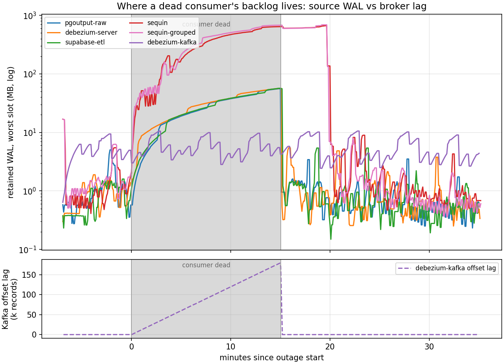

# CDC benchmark guide

An open-pipeline harness: a load generator writes a verifiable change stream into Postgres, a CDC system captures it from the logical WAL, and a harness-owned receiver terminates every consumer's delivery — timestamping arrivals, injecting chaos (dead/slow consumers, sink outages), and verifying the stream against a source-side ledger.

The model under test is **fan-out**: one source database, one change stream, many downstream consumers — some slow, dead, or misbehaving. The core question is *what a bad consumer costs the source database*, and what each architecture's insulation layer buys and costs:

```
loadgen ──SQL──▶ Postgres ──WAL──▶ capture ──▶ [insulation layer] ──▶ consumer 1..N
(harness)        (shared)          (SUT)        (SUT: Kafka /          (harness
                                                 internal buffer /      receiver ×N)
                                                 nothing)
```

### The six arms

| `--system` | Topology | Slots for N consumers | What it is |
|---|---|---:|---|
| `pgoutput-raw` | slot-per-consumer | N | in-repo SQL-polling pgoutput baseline, no insulation |
| `debezium-server` | slot-per-consumer | N | one Debezium Server (JVM) per consumer, batched HTTP sink |
| `supabase-etl` | slot-per-consumer | N | in-repo Rust binary embedding the [supabase/etl](https://github.com/supabase/etl) crate |
| `sequin` | shared slot + buffer | 1 | [Sequin](https://github.com/sequinstream/sequin) + Redis; per-sink cursors over its own buffer |
| `sequin-grouped` | shared slot + buffer | 1 | Sequin with `message_grouping` (documented per-PK ordering) |
| `debezium-kafka` | broker | 1 | Debezium Kafka Connect → Kafka; fan-out at the consumer-group layer |

### What the sweeps found

Full write-ups: [full-scale events sweep](../results/cdc-sweep-long/SUMMARY.md) (15-minute outage) · [heterogeneous-profile sweep](../results/cdc-sweep-hetero/SUMMARY.md) (mixed consumer speeds) · [ledger consistency sweep](../results/cdc-sweep-ledger/REPORT.md).




**Correctness:** every sweep cell passes ledger verification — zero lost events on every consumer of every system, through 15-minute consumer outages, for all six arms. Cross-table transaction integrity and balance conservation hold everywhere. The one behavioural difference: Sequin replays a recovered consumer's backlog out of per-key order (tens of thousands of reordered redeliveries; `message_grouping` didn't change it in v0.14.6) — at-least-once with reordering, where every other arm recovers with zero duplicates and zero reordering.

**Where a dead consumer's backlog lives** (15-minute outage at 200 events/s):

| Topology | Source slot WAL | Backlog elsewhere |
|---|---:|---|
| slot-per-consumer | ~57 MB, all pinned by the dead consumer's own slot | — |
| shared slot + buffer (Sequin) | **642–680 MB** on the one slot every sink shares | its own state store |
| broker (Kafka) | **flat ~11 MB** | 179k records of consumer-group offset lag |

**Replay asymmetry:** after the consumer heals, slot- and broker-based arms drain the 15-minute backlog in **seconds** (18–36k events/s replay); Sequin's buffer takes **~9 minutes**, and the grouped variant longer still. Recovery-time-to-parity is currently the sharpest differentiator in the lineup.

**Latency insulation is the mirror image of WAL insulation.** With a mixed fleet (fast/normal/slow consumers), the slot-per-consumer and broker arms give each consumer the latency of its own speed — the slow consumer queues behind its own handling, the fast consumer is untouched. Sequin's buffer absorbs the slow sink entirely (a flat 33 ms p99 for every profile): the best steady-state mixed-fleet latency, from the same buffering that couples WAL retention to the slowest sink and replays slowly after an outage.

**Steady-state ladder** (200 events/s, worst-consumer median rolling p99): supabase-etl 26 ms < sequin 33 ms < pgoutput-raw 70 ms < debezium-server ~850 ms < debezium-kafka ~960 ms. Memory spans 13 MB (supabase-etl) to ~1.7 GB (the JVM arms).

### Quick start (CDC)

```sh
# End-to-end smoke: loadgen → Postgres → pgoutput → receiver, with a
# dead-consumer chaos phase and ledger verification (~90 s; needs docker + cargo)
uv run cdc --system pgoutput-raw --scenario smoke --rate 100

# Any other arm (images are pulled on first use)
uv run cdc --system sequin --scenario smoke --rate 100 --drain-timeout-s 120

# A sweep: all six arms × {fanout_steady, dead_consumer}, then a report
bash scripts/cdc_sweep.sh results/my-sweep
uv run python scripts/cdc_sweep_report.py results/my-sweep > results/my-sweep/REPORT.md
```

Workload modes: `--mode events` (single table), `ledger` (cross-table transfers, balance conservation), `outbox` (transactional outbox with janitor deletes). Chaos phases cover dead/slow consumers, sink outages, giant transactions, mid-stream DDL, and slot invalidation. [`docs/cdc-harness-design.md`](cdc-harness-design.md) has the architecture and rationale; [`docs/cdc-sut-notes.md`](cdc-sut-notes.md) has per-system integration facts, the verifier's design principles, and remaining gaps.

These are the linked historical sweeps; the September AWA campaign did not rerun CDC.
