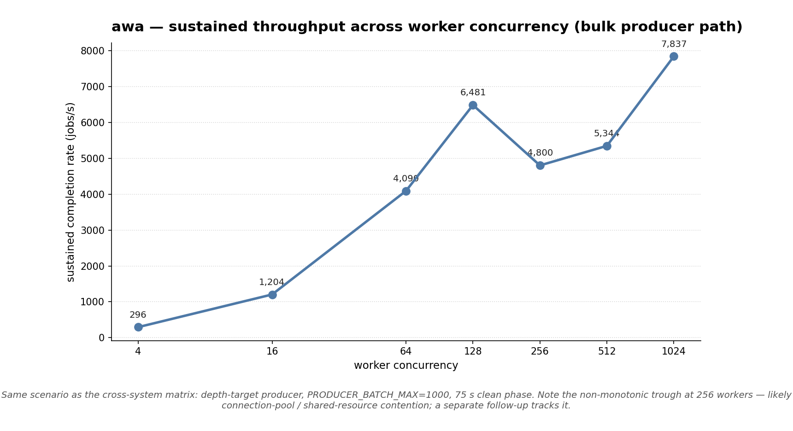

# 2026-05-01 — awa scaling at high worker counts

Follow-up to the
[bulk-everywhere matrix](../2026-05-01-bulk-everywhere/SUMMARY.md):
that matrix capped at 128 workers, where awa was still climbing
(6,481 jobs/s with no obvious plateau). This run extends awa to
256 / 512 / 1024 workers on the same scenario shape and same
postgres image to find the real ceiling on this rig.

Closes [#3](https://github.com/hardbyte/postgresql-job-queue-benchmarking/issues/3).

## Methodology

- awa-only re-run (the framework-bound systems already plateau by 16
  workers; pushing them to 1024 wouldn't change the picture).
- `--producer-rate 50000 --producer-mode depth-target --target-depth 4000`
- `PRODUCER_BATCH_MAX=1000`
- 30 s warmup + 75 s clean per data point.
- Same `postgres:17.2-alpine`, same `postgres.conf`, single replica.

`TARGET_DEPTH` was raised from 2000 (matrix default) to 4000 because
at 1024 workers a 2000-job depth would drain in milliseconds and the
producer's 1 s polling cycle would never catch up — the queue would
oscillate between near-empty and full. 4000 keeps the producer
pressure relevant at the higher worker counts.

## Result



| Workers | Throughput | Queue depth |
|---:|---:|---:|
| 4 | 296 | 26,700 |
| 16 | 1,204 | 26,378 |
| 64 | 4,090 | 14,420 |
| 128 | 6,481 | 20,597 |
| 256 | **4,800** | 10,688 |
| 512 | 5,344 | 9,616 |
| 1024 | **7,837** | 12,704 |

(Claim-p95 omitted — overshot queue depth, same producer-overshoot
artefact as the cross-system matrix; see
[#8](https://github.com/hardbyte/postgresql-job-queue-benchmarking/issues/8).)

The 4 → 128 portion is the same as the bulk-everywhere matrix; 256 / 512
/ 1024 are new.

## Reading the curve

- **Peak at 1024 workers: 7,837 jobs/s.** ~1.2× the 128-worker number,
  ~2× the original (non-bulk) baseline.
- **Non-monotonic trough at 256 workers** — throughput *dropped* from
  6,481 (128w) to 4,800 (256w) before climbing again. This is real,
  not noise: each data point is a 75 s clean phase median over ~15
  samples, well above measurement noise. Two plausible causes:
  - **Connection-pool saturation around 256.** awa's claim path
    holds a connection per active worker; the dispatch pool's
    `pg_max_connections=400` is only ~1.5× the worker count, so
    contention on connection acquire goes up sharply right around
    here.
  - **`LWLock` / `Lock` contention on the queue ring metadata.** At
    higher worker counts past a threshold, claim concurrency
    saturates a different shared resource — the 1024-worker recovery
    suggests it's not a hard saturation but a contended-then-resolves
    transition.

  Both hypotheses are testable with the wait-event sampler that's
  about to land in the harness — re-running this matrix with that
  instrumentation will show whether 256 sits in a `LWLock` cliff or
  a connection-acquire wait. Filed for follow-up.

- **Queue depth still elevated at the high end.** Even at 1,024
  workers the median depth is 12.7 k jobs because the bulk producer
  is keeping the queue topped up against `--target-depth 4000`. The
  bench is consumer-bottlenecked at every data point above 16
  workers, which is what we want for a "max sustained throughput"
  measurement, but means real engine claim latency under bounded
  depth isn't observable from this run — see
  [#8](https://github.com/hardbyte/postgresql-job-queue-benchmarking/issues/8).

## What this doesn't tell us

- **Where the curve actually plateaus.** The 1024-worker number is
  the highest seen; we don't know whether 2048 or 4096 keeps climbing
  or finally levels off. If the 256-worker drop is contention rather
  than CPU/IO saturation, the curve might keep climbing as long as
  workers keep being added.
- **What the bottleneck is at each point.** That's what wait-event
  sampling will tell us. Wait until that lands and re-run if you want
  the full picture.
- **Anything about peer systems.** Same image, same scenario, but
  this run is awa-only. If you're picking a system, look at the
  cross-system comparison; this run is purely "how high does awa go
  if you keep adding workers".

## Reproducing

```sh
docker compose up -d postgres
export PRODUCER_BATCH_MAX=1000
for w in 256 512 1024; do
  uv run python long_horizon.py run \
    --systems awa --replicas 1 --worker-count $w \
    --producer-rate 50000 \
    --producer-mode depth-target --target-depth 4000 \
    --phase warmup=warmup:30s --phase clean=clean:75s
done
```

## Files

- [`matrix.csv`](matrix.csv) — three rows (256, 512, 1024)
- [`plots/awa_extended_scaling.png`](plots/awa_extended_scaling.png)
