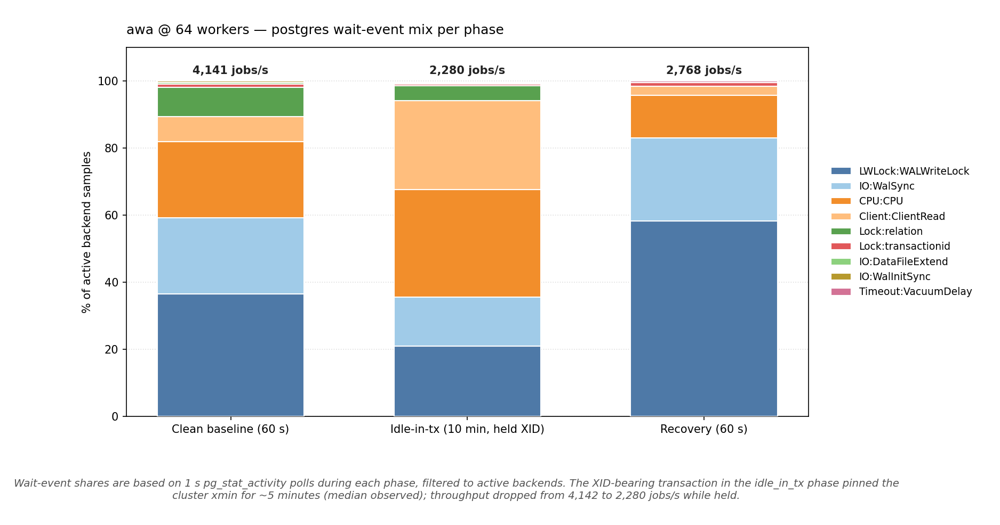

# 2026-05-01 — awa under a held writing transaction (with wait-event sampling)

What does awa look like on the postgres-side wait-event timeline when
an external client holds a writing transaction (XID-bearing) for ten
minutes?

This run combines three things that aren't covered by the
cross-system matrix runs in this repo:

1. A meaningful sustained rate (~4 k events / s during clean phase)
   rather than a few hundred.
2. A long-running idle-in-tx holder (10 minutes, with an XID assigned
   via `txid_current()`) that pins the cluster `xmin` and prevents
   autovacuum from reclaiming dead tuples for the duration.
3. Per-second `pg_stat_activity` polling throughout, so the read
   isn't *whether* a system slows down under MVCC pressure but *what
   postgres-side wait events accumulate* while it does.

## Scenario

- **system:** awa 0.6.0-alpha.0, queue-storage engine
- **workers:** 64
- **producer:** depth-target, `TARGET_DEPTH=2000`,
  `--producer-rate 50000`, `PRODUCER_BATCH_MAX=1000` (bulk path
  through `enqueue_params_batch`)
- **postgres:** `postgres:17.2-alpine`, single replica, same
  `postgres.conf` as every other run in this repo
- **phases (16 min total):**
  1. `warmup` — 60 s
  2. `clean` baseline — 60 s, no held tx
  3. `idle_in_tx` — **600 s (10 min)**, one client opens
     `BEGIN; SELECT txid_current(); …` and holds it until phase end.
  4. `recovery` — 60 s, transaction released, autovacuum catches up
- **sampling:** the harness's wait-event sampler
  (`bench_harness/wait_events.py`) polls `pg_stat_activity` every 1 s,
  filters to `state != 'idle'`, and aggregates per phase.

## Headline



| Phase | Throughput | Active samples | Top wait events |
|---|---:|---:|---|
| **clean** (60 s, no held tx) | **4,142 jobs/s** | 216 | 36.6% LWLock:WALWriteLock · 22.7% IO:WalSync · 22.7% CPU · 8.8% Lock:relation · 7.4% Client:ClientRead · 0.9% Lock:transactionid |
| **idle_in_tx** (600 s, XID held) | **2,280 jobs/s** | 2,667 | 31.9% CPU · 26.5% Client:ClientRead · 20.9% LWLock:WALWriteLock · 14.7% IO:WalSync · 4.5% Lock:relation · 0.5% Lock:transactionid |
| **recovery** (60 s, released) | **2,768 jobs/s** | 189 | 58.2% LWLock:WALWriteLock · 24.9% IO:WalSync · 12.7% CPU · 2.6% Client:ClientRead · 1.1% Lock:transactionid |

Median observed `oldest_xact_age_s` during the held phase: **300 s**
(half the 600 s window — sampling caught the holder mid-life, exactly
as expected). `oldest_idle_in_tx_age_s` matched, confirming the holder
really was idle-in-tx the whole time.

## What's actually limiting throughput

**Clean phase (4,142 jobs/s):** dominated by WAL write + sync —
`LWLock:WALWriteLock` (36.6%) + `IO:WalSync` (22.7%) is **59% of
backend time on WAL alone**. With 64 workers committing at ~4 k/s
and bulk-batched producer commits on top, the `synchronous_commit`
path is the gating resource. Tuple-level lock waits are negligible
(`Lock:transactionid` 0.9%, `Lock:relation` 8.8%).

**Idle_in_tx phase (2,280 jobs/s, 45% drop):** the WAL share drops
sharply (LWLock:WALWriteLock 36.6 → 20.9%, IO:WalSync 22.7 →
14.7%) and `CPU` + `Client:ClientRead` rise (each above 25%). The
postgres side is quieter per query, but workers spend more time
between queries — each backend's "active" sample now includes more
`ClientRead` waiting for the client to send the next query.

The probable mechanism: the held xmin prevents partition rotation
from reclaiming the receipt ring, so claim walks longer chains
through dead-but-not-yet-reclaimed tuples. That's awa-side
work-per-claim going up, which manifests on the postgres side as
"backend isn't waiting on us, it's waiting on the client to ask the
next thing." `Lock:transactionid` does **not** rise — there's no
hot-row UPDATE here for transactions to fight over, since the
queue-storage engine routes claim and completion through
append-only ready-entries → lease-claims with a partitioned
closure tombstone.

**Recovery (2,768 jobs/s):** climbing back. WAL share spikes to
58.2% because unblocked autovacuum is now competing with worker
writes for WAL. Throughput hasn't fully recovered to 4.1 k — there's
still a backlog of dead tuples being processed by autovacuum.
Another 60–120 s would probably close the gap.

## On `Lock:transactionid` specifically

Across all three phases, `Lock:transactionid` sits at 0.5–1.1% of
active backend samples — including the 10-minute idle-in-tx phase
that should be the worst case for hot-row UPDATE contention. This is
a feature of the storage engine, not of the workload: 0.6's queue
storage doesn't run an `UPDATE awa.jobs SET state='running' WHERE …`
during claim, so two consumers don't fight on a shared "current
state" cell.

The earlier engine (the canonical, row-mutating one shipped in 0.5.x
and still selectable today via `--storage-engine canonical`) does
run claim as a hot-row `UPDATE`. A bench against that engine under
the same scenario would almost certainly show `Lock:transactionid`
rising materially with worker count, because that's exactly the
pattern the row-level UPDATE introduces. We have not run that
comparison in this repo; if anyone is curious, it's a worthwhile
follow-up — pass `AWA_STORAGE_ENGINE=canonical` to awa-bench and
re-run.

## What's worth chasing next

1. **Why does throughput drop 45 % during idle_in_tx if `Lock:transactionid` doesn't rise?** Probable answer: receipt-ring rotation can't reclaim partitions while xmin is pinned, so the working set walked by claim grows. The wait-event view shows the postgres-side shape; awa-side per-call timing would confirm. Worth instrumenting.
2. **Higher worker counts under held-xmin.** This run is at 64
   workers. The
   [extended scaling run](../2026-05-01-awa-extended-scaling/SUMMARY.md)
   showed a non-monotonic dip at 256 workers in the no-held-tx
   shape. Whether that dip is shaped the same way under held-xmin
   pressure would be a useful read.
3. **Long-running RR readers.** The harness already has an
   `active-readers` phase type that opens N `REPEATABLE READ`
   connections (default 4) and loops them on a hot-table scan.
   Running that for 10 min, sampling on, against awa is the natural
   companion to this run. Surfaces a different MVCC-pressure shape
   (`pg_dump`-style readers, lagging logical slot) than idle-in-tx.
4. **Same scenario against `awa-canonical`.** The 0.5.x
   row-mutating engine is still selectable. A direct comparison
   under the same workload + sampling would close the loop on
   "what does the engine choice cost in wait-event terms."

## Caveats

- One-machine, one scenario. Same disclaimer as every other run in
  this repo: workload shape changes the answer.
- 1 s sampling cadence on `pg_stat_activity` undercounts very short
  waits and overcounts long ones. The percentages here are a *shape*
  reading, not an absolute attribution. With 2,667 active samples
  during the 10-min held phase the noise is bounded but not zero.
- Dead-tuple growth during the held phase isn't reported here — the
  wait-event sampler doesn't capture `pg_stat_user_tables`. The
  long-horizon adapter samples that separately; see the 04-28
  comparison for the dead-tuple shape under similar pressure.

## Files

- [`raw.csv`](raw.csv) — full sample stream, 9.3 MB
- [`summary.json`](summary.json) — per-phase aggregates including
  the wait-event histogram
- [`manifest.json`](manifest.json) — run config + postgres settings
- [`plots/wait_events_per_phase.png`](plots/wait_events_per_phase.png)

## Reproducing

```sh
docker compose up -d postgres
export PRODUCER_BATCH_MAX=1000
uv run python long_horizon.py run \
  --systems awa --replicas 1 --worker-count 64 \
  --producer-rate 50000 \
  --producer-mode depth-target --target-depth 2000 \
  --phase warmup=warmup:60s \
  --phase clean=clean:60s \
  --phase idle_in_tx=idle-in-tx:600s \
  --phase recovery=recovery:60s
```
