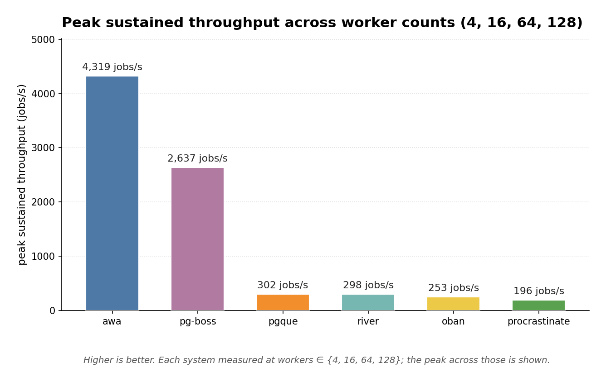
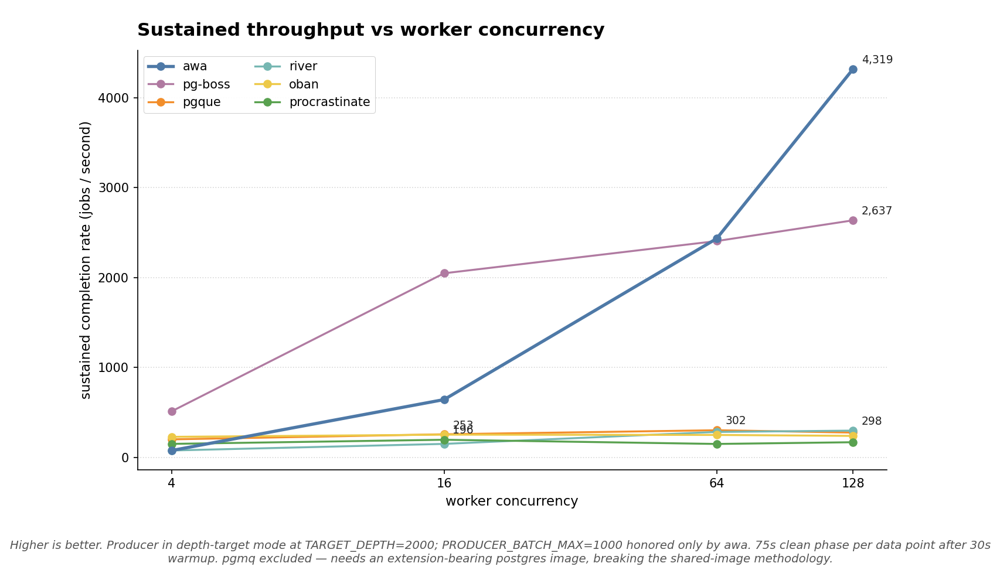

# 2026-05-01 — worker-scaling and max sustained throughput

**Bench captured:** 2026-04-30 — 2026-05-01

This is the answer to two questions: **what's each system's max
sustained throughput?** and **how does that throughput scale as you
add workers?**

## Methodology

Each system runs at four worker counts: **4, 16, 64, 128**.

For every (system, worker_count) pair we run a 30 s warmup followed by
a 75 s clean phase. The producer is in **depth-target** mode at
`TARGET_DEPTH=2000` with `--producer-rate 50000`, which oversubscribes
every system: the producer pushes hard until the queue depth approaches
the target, then backs off. The achieved completion rate over the
clean phase is the system's *sustained* throughput — i.e. the rate it
can actually drain at, with the queue always topped-up enough that
workers are never starved.

Producer batching: `PRODUCER_BATCH_MAX=1000` is set globally; only the
awa adapter reads it (other adapters ignore it and use their native
producer paths). This lets awa exercise its bulk-ingestion path; for
the others the producer is whatever they natively support.

Same `postgres:17.2-alpine` for every system. Same `postgres.conf`.
Single replica per system. Job body is the harness's standard 1 ms
payload work.

**Excluded:** pgmq. The standard postgres image doesn't ship the
`pgmq` extension, so the harness's `CREATE EXTENSION pgmq` preflight
fails. Running pgmq under a Tembo image with the extension baked in
would break the shared-image methodology that keeps this comparison
fair; we'd need a separate scenario type for "extension-bearing
images." Filed as a follow-up.

## Headline



| System | Peak sustained throughput | Where it peaks |
|---|---:|---|
| **awa** | **4,319 jobs/s** | 128 workers (still climbing — likely higher at 256+) |
| pg-boss | 2,637 jobs/s | 128 workers |
| pgque | 302 jobs/s | 64 workers (plateau) |
| river | 298 jobs/s | 128 workers (plateau) |
| oban | 253 jobs/s | 16 workers (plateau) |
| procrastinate | 196 jobs/s | 16 workers (plateau) |

## Scaling curve



Two distinct behavioural shapes:

- **Worker-bound systems** — awa and pg-boss scale near-linearly with
  worker count. awa is the cleaner curve: 76 → 643 → 2,434 → 4,319
  across 4 → 16 → 64 → 128 workers. pg-boss: 512 → 2,048 → 2,406 →
  2,637. Both are still climbing at 128 workers; neither has hit a
  per-instance ceiling at this load.
- **Framework-bound systems** — pgque, river, oban, procrastinate all
  plateau in the 200–300 jobs/s range and don't gain from added worker
  concurrency. The bottleneck is per-job framework overhead (lifecycle
  hooks, dispatch tax, pool contention), not the queue engine. Adding
  workers past the plateau adds no throughput.

## Per-(system, worker_count) numbers

| System | Workers | Throughput | Queue depth | Claim p95 |
|---|---:|---:|---:|---:|
| **awa** | 4 | 76 | 24,485 (overshot) | 53 s |
| awa | 16 | 643 | 9,012 | 34 s |
| awa | 64 | 2,434 | 14,002 | 10.4 s |
| awa | 128 | **4,319** | 11,152 | 6.4 s |
| **pg-boss** | 4 | 512 | 2,000 | 4.0 s |
| pg-boss | 16 | 2,048 | 1,232 | 956 ms |
| pg-boss | 64 | 2,406 | 128 | 126 ms |
| pg-boss | 128 | **2,637** | 128 | 168 ms |
| **pgque** | 4 | 201 | 0 | 132 ms |
| pgque | 16 | 257 | 0 | 124 ms |
| pgque | 64 | **302** | 0 | 119 ms |
| pgque | 128 | 276 | 0 | 121 ms |
| **river** | 4 | 77 | 1,498 | 8,705 ms |
| river | 16 | 150 | 4 | 56 ms |
| river | 64 | 283 | 5 | 47 ms |
| river | 128 | **298** | 5 | 46 ms |
| **oban** | 4 | 229 | 2 | 21 ms |
| oban | 16 | **253** | 2 | 17 ms |
| oban | 64 | 250 | 2 | 17 ms |
| oban | 128 | 239 | 2 | 16 ms |
| **procrastinate** | 4 | 150 | 106 | 630 ms |
| procrastinate | 16 | **196** | 62 | 521 ms |
| procrastinate | 64 | 150 | 145 | 1,082 ms |
| procrastinate | 128 | 169 | 37 | 383 ms |

## Reading these numbers honestly

**The high-throughput tier (awa, pg-boss):** these systems scale with
worker concurrency because their per-job overhead is small enough that
adding workers actually adds throughput. awa's `4,319 jobs/s` at 128
workers is its bulk-batched insert path under steady consumer drain.
pg-boss's `2,637` is its per-job state-machine path, which costs more
per job but is still well below saturation at 128 workers.

**The plateau tier (pgque, river, oban, procrastinate):** these
plateau between 200 and 300 jobs/s regardless of worker count. That's
not a weakness — it's what the framework gives you. Each of them has a
different reason for the ceiling:
- **pgque**: producer-side bottleneck. Insert-per-event under its
  consumer-acknowledged design caps throughput at the SQL layer.
- **river**: Go framework adds per-job middleware/hooks; below 16
  workers the framework can't even reach its plateau.
- **oban**: GenServer-per-job pipeline; the dispatch process is a
  natural serializer.
- **procrastinate**: Python-async per-job lifecycle; ~5 ms of fixed
  Python overhead per job multiplies through.

For all four, the framework value is in **what they let you express**
(rate-limiting, batches, cron, middleware, observability) rather than
raw throughput per worker. If your real workload is 100 jobs/s of
real work doing real things, you'll never notice the plateau.

**Latency notes:** the awa low-worker rows show massive `claim p95`
(53 s, 34 s) — those reflect huge backlogs because the producer
overshot what 4 workers could drain. That's not the engine's claim
latency, it's "wait time at the back of a 24k-deep queue." At 64+
workers awa keeps the depth bounded (~11 k) and claim latency drops
to single-digit seconds. The systems that don't show this behaviour
(pgque, oban) have flat queues at all worker counts because they
plateau at low rates so the producer never gets ahead.

## Caveats

- **One scenario, one shape.** Trivial 1 ms job, single Postgres,
  single replica. Real workloads with longer jobs, fan-out, scheduled
  jobs, batches, or cron will reorder this table. Use the harness to
  run your shape; don't extrapolate.
- **Bulk batching only matters for awa here.** `PRODUCER_BATCH_MAX=1000`
  is read by awa-bench's producer path; the other adapters use whatever
  their native producer surface provides. If you compare awa's `4,319`
  to a "single-row INSERT" interpretation of the others, that's not
  fair — most of those systems also have bulk-friendly options that
  this bench doesn't exercise. The number is awa's *bulk-ingest peak*,
  not its *one-job-at-a-time peak*.
- **awa's curve was still climbing at 128 workers.** The peak number
  is a *floor* on awa's ceiling, not its actual ceiling. A future run
  with 256 / 512 workers would tell us where awa actually plateaus on
  this machine.
- **pgmq missing.** Needs a postgres image with the `pgmq` extension
  baked in (e.g. Tembo). Filed as a follow-up that needs a separate
  scenario family — running pgmq on a different image breaks the
  apples-to-apples postgres baseline.
- Producer overshoot at 4 workers (visible in awa, river, pg-boss
  queue_depth columns): the depth-target backoff has a ~1 s poll
  interval, so under a high producer-rate the queue can climb before
  the producer notices. The completion-rate measurement is still
  valid (workers are draining at their actual ceiling), but the queue
  size and claim latency at low worker counts reflect the overshoot,
  not the engine.

## Reproducing

```sh
docker compose up -d postgres
export PRODUCER_BATCH_MAX=1000
for sys in awa pgque procrastinate pgboss river oban; do
  for w in 4 16 64 128; do
    uv run python long_horizon.py run \
      --systems $sys \
      --replicas 1 \
      --worker-count $w \
      --producer-rate 50000 \
      --producer-mode depth-target \
      --target-depth 2000 \
      --phase warmup=warmup:30s \
      --phase clean=clean:75s
  done
done
```

Aggregate from each run's `raw.csv` (median of `completion_rate` over
the `clean` phase per system).

## Files

- [`matrix.csv`](matrix.csv) — full numerical matrix
- [`plots/throughput_scaling.png`](plots/throughput_scaling.png)
- [`plots/peak_throughput.png`](plots/peak_throughput.png)
