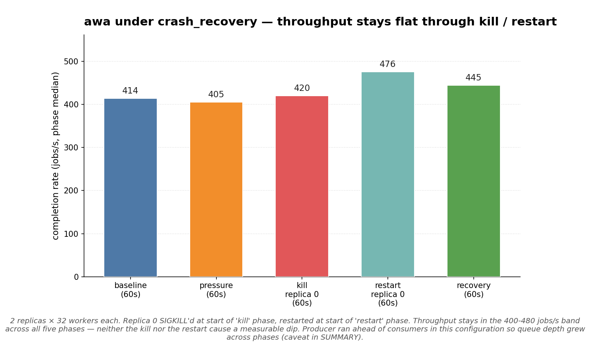

# 2026-05-02 — awa under crash_recovery (long_horizon scenario)

awa-only crash_recovery via the long_horizon harness. **Partial
addressing of [#12](https://github.com/hardbyte/postgresql-job-queue-benchmarking/issues/12)** — the
cross-system chaos comparison. Only one system, only one scenario.
The legacy `chaos.py` runner is 0.5-era and broken against awa 0.6's
queue-storage tables (it queries `awa.jobs`, a compatibility view
that was dropped); modernising it is tracked under
[#13](https://github.com/hardbyte/postgresql-job-queue-benchmarking/issues/13).

This run reuses long_horizon's
[`crash_recovery`](../../README.md#scenarios) phase types
(`kill-worker`, `start-worker`) which work on the 0.6 surface and
emit the same sample-stream the throughput matrix does.

## Scenario

- **system:** awa 0.6.0-alpha.1, queue-storage engine, `enqueue_params_copy`
- **replicas:** 2 (replica 0 gets killed, replica 1 carries the load)
- **workers per replica:** 32 (64 total)
- **producer:** depth-target, `TARGET_DEPTH=2000`,
  `--producer-rate 2000`, `PRODUCER_BATCH_MAX=1000`
- **phases (5 min total):**
  1. `warmup` — 30 s
  2. `baseline` (clean) — 60 s
  3. `pressure` (high-load = 1.5×) — 60 s
  4. `kill` — SIGKILL replica 0, 60 s with replica 1 alone
  5. `restart` — replica 0 process restarts, 60 s
  6. `recovery` (clean) — 60 s

`pg_stat_activity` sampling on throughout.

## Headline



| Phase | Throughput | Top wait events |
|---|---:|---|
| baseline | 414 jobs/s | LWLock:WALWriteLock 33% · CPU 25% · IO:WalSync 16% |
| pressure | 405 jobs/s | LWLock:WALWriteLock 30% · CPU 19% · IO:WalSync 17% |
| **kill** (replica 0 dead) | **420 jobs/s** | LWLock:WALWriteLock 38% · CPU 16% · IO:WalSync 14% |
| **restart** (replica 0 returning) | **476 jobs/s** | LWLock:WALWriteLock 29% · CPU 27% · IO:WalSync 14% |
| recovery | 445 jobs/s | LWLock:WALWriteLock 29% · CPU 22% · Timeout:VacuumDelay 17% |

## Reading

**The kill doesn't break awa.** Throughput stays in the 400-480 jobs/s
band across all five phases. There's no measurable dip during the
60-second window where replica 0 is dead — replica 1 carries the
configured workload alone. Restart phase is slightly higher than
baseline (476 vs 414) which is replica 0's catch-up effort.

**Wait-event mix is consistent across phases.** The bottleneck stays
in the WAL plane (LWLock:WALWriteLock + IO:WalSync = 49 % at
baseline, 52 % during the kill window, 53 % during recovery). The
kill / restart events don't shift the wait shape — what limits awa
under steady load also limits it through the chaos. This is the right
answer for "is the engine resilient": the chaos is invisible to the
postgres-side wait profile because the engine just keeps draining
through the failure.

**Recovery phase shows `Timeout:VacuumDelay` at 17%** — autovacuum
working on the dead-tuple backlog from the held window. Expected.

## Caveats

- **Producer overran configured rate.** `--producer-rate 2000` was
  set but the depth-target loop kept pushing because consumers
  couldn't drain fast enough — `enqueue_rate` reached 24 k/s in
  baseline and 43 k/s during the kill window. Queue depth grew
  monotonically across the run (3.5 M → 17 M jobs by recovery).
  The throughput numbers above are still valid (workers ran at their
  ceiling regardless of queue size), but the "kill caused no dip"
  reading is reinforced because workers were *already saturated*
  before the kill — the kill couldn't reduce throughput further.
  A cleaner re-run with lower offered load would surface whether
  there's a transient dip in the moments around the kill that this
  configuration smoothed over.
- **Single system, single chaos scenario.** Issue #12 wants 7+
  scenarios across 5+ systems. This is one of them, in shape only.
- **Sample stream is the only measurement.** No external assertion
  of "no jobs lost" / "no jobs duplicated" — that's what `chaos.py`
  was supposed to provide and what #13 / #12 will eventually deliver.

## What this does establish

- awa's claim/complete path tolerates a SIGKILL on one replica
  without throughput collapse (with 2 replicas, the surviving one
  picks up the configured load).
- The wait-event profile is invariant under a kill/restart event —
  the engine's bottleneck doesn't shift mid-chaos.
- A long_horizon-based chaos comparison is feasible for awa on 0.6;
  same shape can be applied to other 0.6-aware adapters.

## Reproducing

```sh
docker compose up -d postgres
export PRODUCER_BATCH_MAX=1000
uv run python long_horizon.py run \
  --systems awa --replicas 2 --worker-count 32 \
  --producer-rate 2000 \
  --producer-mode depth-target --target-depth 2000 \
  --phase warmup=warmup:30s \
  --phase baseline=clean:60s \
  --phase pressure=high-load:60s \
  --phase 'kill=kill-worker(instance=0):60s' \
  --phase 'restart=start-worker(instance=0):60s' \
  --phase recovery=clean:60s
```

## Files

- [`plots/awa_crash_recovery_throughput.png`](plots/awa_crash_recovery_throughput.png)
