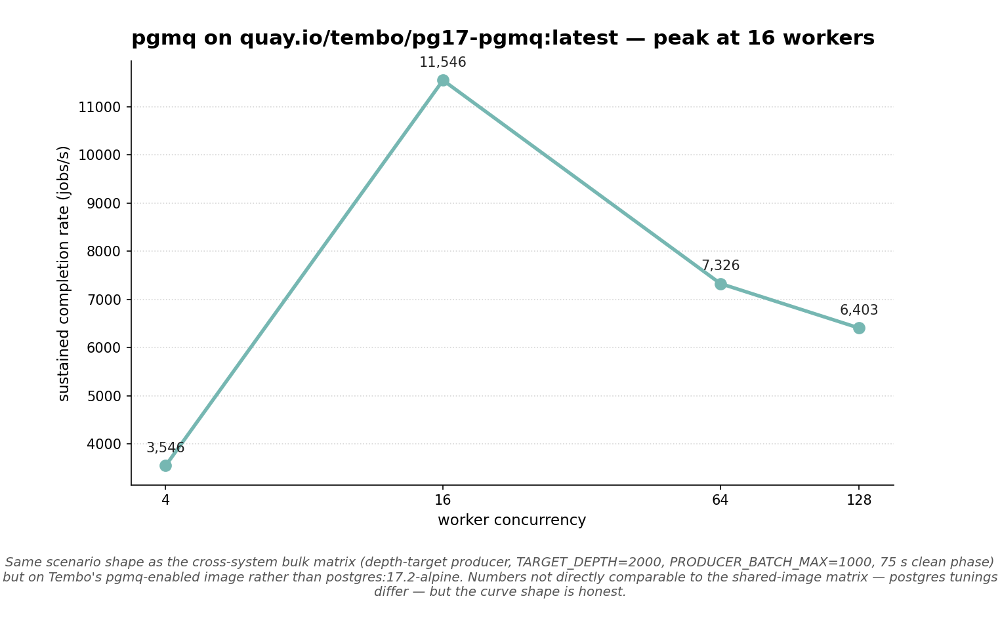

# 2026-05-02 — pgmq on `quay.io/tembo/pg17-pgmq`

First pgmq run published in this repo. Closes
[#4](https://github.com/hardbyte/postgresql-job-queue-benchmarking/issues/4).

## Methodology

Same scenario shape as the
[bulk-everywhere matrix](../2026-05-01-bulk-everywhere/SUMMARY.md):
30 s warmup + 75 s clean phase per (system, worker_count) cell,
depth-target producer at `TARGET_DEPTH=2000`,
`PRODUCER_BATCH_MAX=1000`, `pgmq.send_batch` for the producer call.

**Image:** `quay.io/tembo/pg17-pgmq:latest` instead of the bench's
default `postgres:17.2-alpine`. The image is required to load the
`pgmq` extension.

## Result



| Workers | Throughput | Enqueue rate |
|---:|---:|---:|
| 4 | 3,546 jobs/s | 3,558 jobs/s |
| **16** | **11,546 jobs/s** | 11,584 jobs/s |
| 64 | 7,326 jobs/s | 7,413 jobs/s |
| 128 | 6,403 jobs/s | 6,639 jobs/s |

Peak at **16 workers** (11.5 k jobs/s). Adding more workers past 16
*reduces* throughput — pgmq's consumer model serialises through a
small number of partition heads and adding workers past the natural
parallelism makes them contend rather than help.

This matches the documented design: pgmq is SQS-shaped and uses
visibility timeouts on a partitioned archive. The throughput ceiling
is the number of distinct visibility-timeout cursors the consumer
side can advance in parallel; once that's saturated, adding workers
adds contention not capacity.

## Caveats

- **Not directly comparable to the shared-image matrix.** The Tembo
  image's postgres tunings, kernel-side optimisations, and
  `shared_buffers` may differ from `postgres:17.2-alpine`. The shape
  of pgmq's curve is honest; the absolute numbers shouldn't be
  cross-referenced against the other systems' bulk numbers without
  caveat.
- **`pgmq.send_batch` is the documented bulk producer path.** Same
  shape as the other adapters' bulk paths.
- **Single replica.** Multi-replica pgmq with separate consumer names
  is a different topology; not exercised here.
- **No wait-event sampling on this image.** `pg_stat_activity` polling
  works against any postgres image, but pg_ash wasn't installed on
  this run. Future work.

## Reproducing

```sh
# Note the --pg-image flag — the bench's default postgres:17.2-alpine
# does not have pgmq.
export PRODUCER_BATCH_MAX=1000
for w in 4 16 64 128; do
  uv run python long_horizon.py run \
    --systems pgmq --replicas 1 --worker-count $w \
    --pg-image quay.io/tembo/pg17-pgmq:latest \
    --producer-rate 50000 \
    --producer-mode depth-target --target-depth 2000 \
    --phase warmup=warmup:30s --phase clean=clean:75s
done
```

## Files

- [`matrix.csv`](matrix.csv) — full numerical matrix
- [`plots/pgmq_scaling.png`](plots/pgmq_scaling.png)
