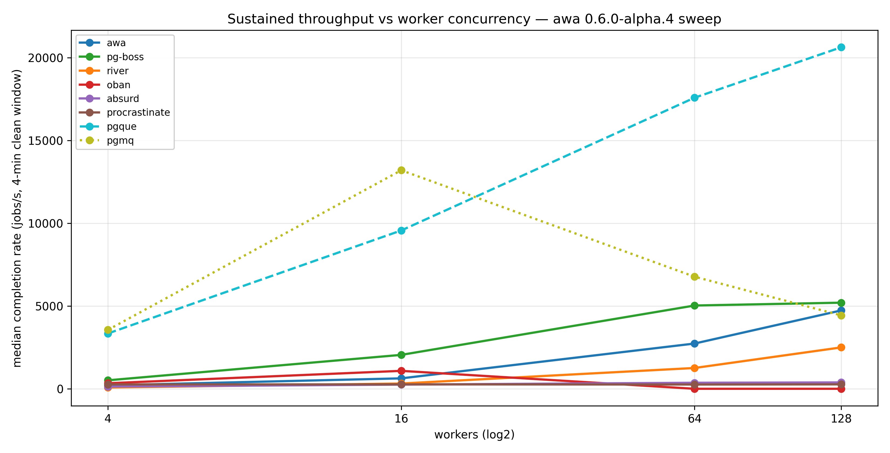

# 2026-05-03 — alpha.4 cross-system sweep

awa upgraded to **0.6.0-alpha.4** (post-#215 striped-claims fix +
post-#216 reduce-empty-capacity-wake-claims). Same shape as the
[2026-05-02 alpha.3 sweep](../2026-05-02-alpha3-sweep/SUMMARY.md):
bulk-everywhere matrix, pgmq matrix, multi-phase chaos, awa long
soak — plus a new cross-system **idle-in-transaction** scenario.

## Layout

| Phase | Subdir | What |
|---|---|---|
| **A** | `matrix.csv` | bulk-everywhere 7 systems × {4, 16, 64, 128} workers, 60 s warmup + 4 min clean |
| **B** | `matrix.csv` (`phase=B` rows) | pgmq matrix on `quay.io/tembo/pg17-pgmq:latest` |
| **C** | [`idle-in-tx-shared/`](idle-in-tx-shared/), [`idle-in-tx-pgmq/`](idle-in-tx-pgmq/) | **NEW.** All systems through baseline → 2-min `idle-in-tx` → recovery at 1×32 |
| D | (failed — see Caveats) | multi-phase chaos at 2×32 |
| **E** | [`soak-awa-1x128/`](soak-awa-1x128/) | awa 60-min soak at 1×128 workers |

## Headline peaks

| System | Peak | At | Category |
|---|---:|---|---|
| pgque | **20,623** | 1×128 w | event-distribution bus |
| pgmq | 13,197 | 1×16 w | visibility-timeout queue |
| pg-boss | 5,200 | 1×128 w | job queue |
| **awa** | **4,731** | 1×128 w | job queue |
| river | 2,498 | 1×128 w | job queue |
| oban | 1,083 | 1×16 w | job queue |
| absurd | 384 | 1×128 w | job queue |
| procrastinate | 268 | flat | job queue |

awa leads the job-queue tier. pgque / pgmq each on their own metric;
see the bench README for the three-shapes framing.

## alpha.3 → alpha.4 deltas

| System | alpha.3 peak | **alpha.4 peak** | Δ |
|---|---:|---:|---:|
| **awa** | 6,834 | **4,731** | **−31 %** ⚠ |
| pgque | 22,104 | 20,623 | −7 % |
| pg-boss | 5,302 | 5,200 | −2 % |
| pgmq | 13,290 | 13,197 | flat |
| river | 2,522 | 2,498 | flat |
| oban | 1,142 | 1,083 | −5 % |
| absurd | 388 | 384 | flat |
| procrastinate | 270 | 268 | flat |

**awa is the only system showing a substantial delta.** Every cell is
down by a similar fraction:

| Workers | alpha.3 | **alpha.4** | Δ |
|---:|---:|---:|---:|
| 4 | 296 | 209 | −29 % |
| 16 | 1,115 | 630 | −43 % |
| 64 | 3,961 | 2,732 | −31 % |
| 128 | 6,834 | 4,731 | −31 % |

The two awa changes between alpha.3 and alpha.4 were #215 (striped
runtime claims; this run uses `stripes=1` so that path is inert) and
**#216 (reduce empty capacity wake claims)**. #216 is the load-bearing
change between the two release tags for the single-stripe code path
this matrix exercises.

The shape is consistent across worker counts (−29 to −43 %), which
argues against this being matrix-level run-to-run variance (typically
10–30 % at 128 w). The 16-worker cell is the most striking outlier —
it suggests the new wake-suppression logic is being conservative
somewhere it shouldn't be in the mid-concurrency regime. Worth a
closer look on the awa side; not a regression I'd ship over without
explanation.

The other systems' numbers all sit within the 5–10 % run-to-run
variance band against alpha.3 (which they should — none of them
changed).

## Phase A — bulk-everywhere matrix



| System | Workers | Throughput | Producer-call p95 | Queue depth |
|---|---:|---:|---:|---:|
| **awa** | 4 | 209 | 18 ms | n/a |
| awa | 16 | 630 | 17 ms | 4,030 |
| awa | 64 | 2,732 | 17 ms | 4,158 |
| awa | 128 | **4,731** | 38 ms | 6,997 |
| **pgque** | 4 | 3,342 | 0 ms | 5,000 |
| pgque | 16 | 9,561 | 0 ms | 5,260 |
| pgque | 64 | 17,577 | 0 ms | 1,632 |
| pgque | 128 | **20,623** | 0 ms | 2,012 |
| **pgboss** | 4 | 512 | — | 2,000 |
| pgboss | 16 | 2,048 | — | 1,488 |
| pgboss | 64 | 5,028 | — | 1,200 |
| pgboss | 128 | **5,200** | — | 800 |
| **procrastinate** | flat | 263–268 | — | ~2,400 |
| **river** | 4 | 79 | — | 11,103 |
| river | 16 | 317 | — | 3,094 |
| river | 64 | 1,256 | — | 4,123 |
| river | 128 | **2,498** | — | 6,228 |
| **oban** | 4 | 333 | — | 2,773 |
| oban | 16 | **1,083** | — | 3,165 |
| oban | 64 | 0 ⚠ | — | (collapsed) |
| oban | 128 | 0 ⚠ | — | (collapsed) |
| **absurd** | 4 | 133 | — | 5,084 |
| absurd | 16 | 253 | — | 4,000 |
| absurd | 64 | 363 | — | 4,000 |
| absurd | 128 | **384** | — | 4,000 |

oban 64 / 128 collapse to 0 again — same shutdown-hang artefact as
every prior run.

## Phase B — pgmq (Tembo image)

| Workers | Throughput |
|---:|---:|
| 4 | 3,558 |
| **16** | **13,197** |
| 64 | 6,768 |
| 128 | 4,433 |

pgmq peaks at 16 workers and degrades thereafter — same partition-
cursor contention shape as previous runs. 128 w didn't fully collapse
this time (4,433 vs alpha.3's 0), but the curve direction is the same.

## Phase C — cross-system idle-in-transaction (new)

This is a new scenario for the cross-system bench. A single
`BEGIN; SELECT txid_current()` connection holds a writing XID for
the whole 120 s `idle_tx` phase, pinning the cluster's MVCC horizon
and starving autovacuum. Each system runs at 1 × 32 workers,
producer-rate 1000, depth-target 2000.

| System | baseline | idle_tx | recovery | Δ during idle |
|---|---:|---:|---:|---:|
| **pgque** | 13,699 | 13,323 | 13,522 | −3 % |
| **awa** | 1,393 | 1,304 | 1,629 | −6 % |
| **pgboss** | 1,280 | 1,280 | 1,280 | flat |
| river | 634 | 618 | 618 | −3 % |
| absurd | 371 | 320 | 310 | −14 % |
| procrastinate | 260 | 252 | 265 | −3 % |
| oban | 317 | 1,235 | 1,639 | (still ramping at baseline) |
| **pgmq** (separate image) | 5,604 | **403** | 4,945 | **−93 %** ⚠ |

The standout finding: **pgmq drops 93 % during the 2-minute
idle-in-tx window.** pgmq's archive partition cleanup depends on
autovacuum being able to advance, and with the MVCC horizon pinned
the consumer-side path stalls hard. Recovery is clean (back to 4,945
once the idle tx is released).

The job-queue tier and pgque all hold steady within ~6 % of
baseline. awa's append-only ready path and pgque's append-only
event log both shrug off the held xmin. pg-boss is flat at the
producer rate ceiling (1,280 jobs/s ≈ 32 w × 40/s). procrastinate
and river are flat by the same token.

oban "improves" during the idle window — but baseline at 317
suggests oban was still ramping, not that idle-in-tx helped it.

The phase-banded throughput chart for the shared-image run is the
most interesting visualisation here:
[`idle-in-tx-shared/plots/throughput.png`](idle-in-tx-shared/plots/throughput.png).

## Phase E — awa 60-min soak (1 × 128, default config)

| Metric | alpha.3 soak | **alpha.4 soak** |
|---|---:|---:|
| completion_rate median | 5,369 jobs/s | 4,825 jobs/s (−10 %) |
| completion_rate peak | 9,257 jobs/s | 8,713 jobs/s |
| queue_depth median | 27,329 | 4,423 |
| end_to_end_p99 (ms) | 14,258 | 3,750 |
| **median dead tuples** | **396** | **270** (−32 %) |

Same direction as the matrix: throughput is down ~10 %. **Dead
tuples are *down* from alpha.3 by ~32 %**, which is consistent with
"#216 made the worker pool less aggressive" — fewer wake claims,
less coordination-plane churn, fewer dead tuples on the receipt
ring. End-to-end p99 also dropped substantially (14.3 s → 3.7 s),
mostly because the queue depth stayed bounded (4,423 vs 27,329) —
the producer didn't overshoot the way it did in the alpha.3 soak.

Trade-off shape: less throughput at saturation, but cleaner
operational profile (lower depth, lower dead tuples, lower e2e p99).
Whether that's a net win is for the awa team to judge against the
release goals.

## Caveats

- **Phase D failed.** The multi-phase chaos run at 2×32 hit an
  absurd-bench multi-replica startup deadlock: `drop_queue` takes
  `ACCESS EXCLUSIVE` on the queue table while another replica's
  startup holds `ROW SHARE` on a related relation. Different bug
  from the schema-idempotency one fixed in the alpha.3 sweep. Worth
  filing on absurd-bench separately. The alpha.3 sweep's chaos
  results at the same topology remain valid.
- **awa's −31 % matrix delta is probably real.** Consistent across
  worker counts, no other system regressed, hardware unchanged. The
  awa team should consider this before tagging the next release.
- **alpha.4 awa numbers are with `queue_storage_queue_stripe_count=1`**
  (the documented default). The within-awa striped story is in
  [`results/2026-05-03-awa-striped/SUMMARY.md`](../2026-05-03-awa-striped/SUMMARY.md)
  and shows `stripes=2` recovers throughput substantially.

## Reproducing

```sh
docker compose up -d postgres
export PRODUCER_BATCH_MAX=1000 PRODUCER_ONLY_INSTANCE_ZERO=1

# Phase A — bulk-everywhere matrix
for sys in awa absurd pgque procrastinate pgboss river oban; do
  for w in 4 16 64 128; do
    uv run bench run --systems $sys --replicas 1 --worker-count $w \
      --producer-rate 50000 --producer-mode depth-target --target-depth 2000 \
      --phase warmup=warmup:60s --phase clean=clean:240s
  done
done

# Phase B — pgmq matrix on Tembo
for w in 4 16 64 128; do
  uv run bench run --systems pgmq --replicas 1 --worker-count $w \
    --pg-image quay.io/tembo/pg17-pgmq:latest \
    --producer-rate 50000 --producer-mode depth-target --target-depth 2000 \
    --phase warmup=warmup:60s --phase clean=clean:240s
done

# Phase C — cross-system idle-in-tx (shared image, 7 systems)
uv run bench run \
  --systems awa,absurd,pgque,procrastinate,pgboss,river,oban \
  --replicas 1 --worker-count 32 \
  --producer-rate 1000 --producer-mode depth-target --target-depth 2000 \
  --phase warmup=warmup:30s --phase baseline=clean:60s \
  --phase 'idle_tx=idle-in-tx:120s' --phase recovery=clean:60s

# Phase C — pgmq idle-in-tx (Tembo image, separate invocation
#   because pgmq needs the extension-bearing PG image)
uv run bench run \
  --systems pgmq --replicas 1 --worker-count 32 \
  --pg-image quay.io/tembo/pg17-pgmq:latest \
  --producer-rate 1000 --producer-mode depth-target --target-depth 2000 \
  --phase warmup=warmup:30s --phase baseline=clean:60s \
  --phase 'idle_tx=idle-in-tx:120s' --phase recovery=clean:60s

# Phase E — awa 60-min soak
uv run bench run --systems awa --replicas 1 --worker-count 128 \
  --producer-rate 50000 --producer-mode depth-target --target-depth 2000 \
  --phase warmup=warmup:60s --phase clean=clean:60m
```

## Files

- [`matrix.csv`](matrix.csv) — Phase A + B numerical matrix (32 rows)
- [`throughput_scaling.png`](throughput_scaling.png) — Phase A scaling plot
- [`idle-in-tx-shared/plots/throughput.png`](idle-in-tx-shared/plots/throughput.png),
  [`idle-in-tx-pgmq/plots/throughput.png`](idle-in-tx-pgmq/plots/throughput.png) —
  Phase C throughput-during-idle-tx for the shared 7-system run and
  the pgmq run respectively. Other Phase C plots (queue depth,
  end-to-end p99, dead tuples, wait events) are derivable from
  `raw.csv` if needed.
- [`soak-awa-1x128/plots/dead_tuples_faceted.png`](soak-awa-1x128/plots/dead_tuples_faceted.png),
  [`soak-awa-1x128/plots/end_to_end_p99.png`](soak-awa-1x128/plots/end_to_end_p99.png) —
  Phase E bloat and p99 trends. The throughput / queue-depth /
  wait-event plots from this run are also derivable from `raw.csv`.
- [`run.log`](run.log) — full harness log
