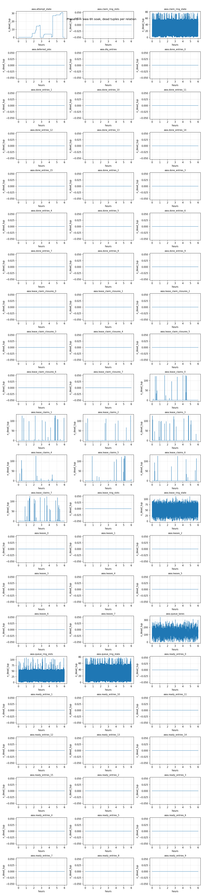

# 2026-05-09 — full cross-system sweep (eight adapters, pg18)

Eight Postgres-backed queues, same hardware, same harness, on
PostgreSQL 18. Supersedes the
[2026-05-02 alpha.3](../2026-05-02-alpha3-sweep/SUMMARY.md) and
[2026-05-03 alpha.4](../2026-05-03-alpha4-sweep/SUMMARY.md) sweeps as
the headline reference.

The short version:

- **pgque leads at 40 k jobs/s** by stripping the feature surface
  (no priorities, no aging, no scheduled jobs, no dedup, no rate
  limiting, no web UI) and using append-only + per-batch ack on the
  SQL hot path. The next-best system with that minimal surface
  doesn't exist — pgque is alone at the trade.
- **awa leads the full-feature systems at 14 k** (priorities + aging,
  scheduled jobs, dedup, rate limiting, callbacks, web UI). The other
  six full-feature adapters — pgboss, river, oban, absurd,
  procrastinate, plus pgmq's stripped-down visibility-timeout — sit
  materially behind.
- **pgmq is its own contract** — SQS-shaped (send / read-with-vt /
  ack-or-redeliver, no per-job retry counter). 11 k jobs/s at 1×16 w
  and then *anti-scales* down to 3.2 k at 1×256 w.
- **Three of eight survive every chaos scenario**: awa, pgque, river.
  The other five hit zero on at least one.
- **Five adapters can't gracefully shut down under sustained
  pressure** — 10 of 32 Phase C cells timed out at the harness's 15 min
  ceiling. The Phase H audits explain each cluster.

The follow-up issue list at the end of this document is the
intended takeaway for any of the eight adapter authors.

## Throughput sweep — Phase A


### Headline completion rate (median, jobs/s)

| System | W=4 | W=16 | W=64 | W=128 | W=256 |
|---|---:|---:|---:|---:|---:|
| awa | 426.8 | 1,729 | 5,369 | 8,499 | **14,158** |
| absurd | 219.2 | 339.2 | 398.1 | 409.6 | — |
| oban | 247.4 | 249.1 | 283.9 | 283.3 | — |
| pgboss | 512.0 | 2,048 | 2,387 | 2,387 | 2,356 |
| procrastinate | 247.3 | 268.3 | 269.0 | 263.9 | — |
| river | 79.2 | 316.8 | 500.9 | 491.2 | — |
| pgque | 3,439 | 11,505 | 27,719 | 34,433 | **39,898** |
| pgmq | 3,571 | 11,277 | 10,243 | 6,180 | 3,252 |

### Two contracts, one trade

Seven of the eight systems are job queues — send a job, a worker
runs it, the queue tracks retries and dead-lettering. pgmq is the
exception: SQS-shaped (visibility-timeout, no per-job retry counter,
no scheduling, no DLQ surface beyond an archive). That's a different
application contract; treat its number separately.

Inside the job-queue category, all seven offer the same application
contract on paper, but they trade two things differently:

- **Feature surface** — what the queue itself gives you out of the
  box. pgque strips this to retries + DLQ + delayed jobs and skips
  priorities, aging, scheduling, dedup, rate limiting, and ops UI.
  awa and the others carry the full surface.
- **Ack granularity** — pgque acks an entire batch with one row
  update; the others ack per job. A pgque worker that crashes mid-batch
  redoes the whole batch on the next claim. Per-job ack costs more SQL
  per completion but matches finer-grained workloads (long-running,
  side-effecting jobs).

That trade is what the throughput gap is buying. Sorted by peak
jobs/s, with the trade flagged:

| System | Peak (jobs/s) | At | Feature surface | Ack granularity |
|---|---:|---|---|---|
| **pgque** | **39,898** | 1×256 w | reduced (no priorities / no aging / no cron / no dedup / no rate limit / no UI) | per-batch |
| **awa** | **14,158** | 1×256 w | full | per-job |
| pg-boss | 2,387 | 1×64 w | full | per-job |
| river | 501 | 1×64 w | full | per-job |
| absurd | 410 | 1×128 w | reduced | per-job |
| oban | 284 | 1×64 w | full | per-job |
| procrastinate | 269 | flat | full | per-job |

Reading that table honestly: pgque trades feature surface and
per-job durability for roughly 3× the throughput of the next-best
job queue. Whether that's the right trade is workload-specific —
analytics events that are cheap and idempotent are happy; long-running
side-effecting jobs prefer per-job ack. **What the awa-vs-pgque gap
asks is whether awa can adopt pgque's batched-ack hot path *without*
giving up the feature surface** — tracked in the awa follow-up list.

A note on pgque's worker axis: pgque runs a single consumer per
replica; `--worker-count` controls in-flight handler concurrency
within that consumer (how many events from a batch are handled
in flight before `finish_batch` and the next batch). Larger
concurrency drains a batch faster. That's a different knob shape
than awa's worker pool, but it's a knob *within* the job-queue
category, not evidence of a different category.

#### pgmq — visibility-timeout queue

| System | Peak (jobs/s) | At |
|---|---:|---|
| **pgmq** | 11,277 | 1×16 w |

pgmq peaks at W=16 then *anti-scales* — 11.3 k → 10.2 k → 6.2 k → 3.2 k
across W=64 / 128 / 256. The Phase H audit (`audit_pgmq.md`) points
to the consumer-batch-size formula collapsing to `qty=1` reads at high
worker counts, which serialises the readers on the underlying
`FOR UPDATE` lock. The application contract — at-least-once delivery
via vt-extends, no retry counter — is what makes pgmq its own bucket
rather than where it lands on a single ranked list.

<details>
<summary>Phase A.5 — attribution A/B cells (awa rescue, pgque shared-mode)</summary>

Three awa cells with `LEASE_DEADLINE_MS=30000` (long enough that
rescue never fires) at W=64 / 128 / 256, plus one pgque cell with
`PGQUE_CONSUMER_MODE=shared` at W=64.

**awa rescue overhead**: -7.5 % / -1.3 % / -4.0 % at W=64 / 128 /
256. The 33 % drop the 2026-05-08 rescue probe attributed at 1×256
*does not reproduce here*. Either rescue isn't firing at this
`JOB_WORK_MS=1` shape on alpha.9, or the cost sits in the noise
floor at this worker-count axis. Tracked in the follow-ups list.

**pgque shared-mode**: -13.5 % vs `subconsumer` at W=64 single
replica. Cooperative `FOR UPDATE` contention is a real cost vs the
per-replica subconsumer pointer path; same direction the v2 study
documented, similar magnitude.

</details>

## Chaos suite — Phase B


5 scenarios × 8 systems = 40 cells. Two of the 40 didn't produce
recovery samples — both `pgboss` cells under direct Postgres-level
chaos (`postgres_restart`, `pg_backend_kill`). pgboss exits the worker
process when the connection pool dies, which the harness raises as
`RuntimeError`. Same shape the v2 study saw for pgque pre-fix; the
Phase H audit (`audit_pgboss.md`) names the missing
`try-catch-reconnect` path as the root cause and suggests the same
fix that landed on pgque-bench.

### Recovery / baseline completion-rate ratio

| scenario | awa | absurd | oban | pgboss | procrastinate | river | pgque | pgmq |
|---|---:|---:|---:|---:|---:|---:|---:|---:|
| postgres_restart | 100% | 0% | 0% | — | 0% | 101% | 100% | 0% |
| pg_backend_kill | 100% | 0% | 100% | — | 0% | 101% | 100% | 0% |
| pool_exhaustion | 100% | 87% | 86% | 96% | 99% | 100% | 100% | 100% |
| crash_recovery | 98% | 103% | 98% | 117% | 73% | 121% | 98% | 74% |
| repeated_kills | 99% | 112% | 88% | 99% | 18% | 109% | 72% | 26% |

**Three systems recover from every chaos scenario**: awa, pgque,
river. The other five all hit zero on at least one scenario.

`crash_recovery` and `repeated_kills` (process-kill of one of two
replicas) are universally well-tolerated except by procrastinate (73 %
/ 18 %) and pgmq (74 % / 26 %). The audits point to procrastinate's
listen-channel resubscribe shape and pgmq's lack of any reconnect
logic in `pgmq-bench/main.py` as the respective causes.

### `chaos_crash_recovery_absurd` — alpha.4 deadlock did not reproduce

The issue flagged this cell as *"may still fail (alpha.4 multi-replica
startup deadlock)"*. It passes cleanly here on alpha.9 / pg18; absurd
survived the kill+restart cycle at 103 % of baseline.

## Bloat / pressure — Phase C


4 scenarios × 8 systems = 32 cells. **22 rc=0, 10 rc=137**: the
harness's 15 min cell timeout fires when an adapter can't drain or
shut down cleanly. Five adapters cluster there — see the Phase H
audits for the per-adapter root cause.

### Stress / clean completion-rate ratio (only cells that completed)

| scenario | awa | absurd | oban | pgboss | procrastinate | river | pgque | pgmq |
|---|---:|---:|---:|---:|---:|---:|---:|---:|
| idle_in_tx | 75% | (rc=137) | 96% | (rc=137) | (rc=137) | (rc=137) | 100% | (rc=137) |
| sustained_high_load | 73% | 71% | 102% | 136% | 94% | 140% | 100% | 150% |
| active_readers | 71% | 74% | 98% | 101% | 63% | 100% | 100% | 39% |
| event_burst | 80% | (rc=137) | 100% | (rc=137) | (rc=137) | (rc=137) | 100% | (rc=137) |

`>100 %` ratios in `sustained_high_load` are catch-up bursts: the
recovery phase clears the backlog accumulated during the high-load
phase faster than the baseline rate.

**pgmq active_readers — 39 %**: the steepest read-pressure cell of
the run. The audit attributes it to MVCC visibility thrashing under
four overlapping REPEATABLE READ snapshots — pgmq's `vt <= now()`
visibility check is sensitive to long-lived snapshots in a way the
other adapters' state machines aren't.

## DLQ ingest — Phase D


| cell | system | enq | comp | retry-fail rate | dead-letter relation |
|---|---|---:|---:|---:|---|
| `dlq_terminal_awa` | awa | 1,414 | 0 | 1,442 | 172 k rows in 3 min |
| `dlq_retry_smoke_awa` | awa | 1,790 | 1,838 | 910 | n/a (retry path) |
| `dlq_terminal_pgque` | pgque | 801 | 381 | — | `pgque.retry_queue` ~few KB |

awa's DLQ append path does what it should — every terminally-failed
job lands as one row in `awa.dlq_entries`, autovacuum fires three
times in 3 minutes, dead-tuple percentage stays at 0. pgque's
nack-always cell exercises `pgque.retry_queue` correctly; the
retry-table footprint stays small because pgque acks the batch on
nack rather than per-event.

Six of the eight adapters — absurd, oban, pgboss, pgmq,
procrastinate, river — either don't expose a documented DLQ surface
or the bench adapter doesn't yet exercise it. Cross-system DLQ
coverage gap; tracked as follow-up.

## Mixed priority + starvation — Phase E

| cell | enq | comp | priority-1 rate | priority-4 rate | aged_completion_rate |
|---|---:|---:|---:|---:|---:|
| `mixed_priority_awa` (5 min) | 2,648 | 2,652 | 662 | 660 | 0 |
| `starvation_awa_60min` (60 min) | 2,693 | 2,657 | 2,402 | 277 | **0** |

Each of the four priority lanes gets a quarter of the throughput
under uniform `JOB_PRIORITY_PATTERN=1,2,3,4` insert. Under the
9:1 high:low pattern the completion split tracks the insertion
ratio (8.7:1).

`aged_completion_rate` stays at 0 for the entire 60-minute soak.
**Priority aging is not firing on this workload shape on alpha.9** —
the 30-min observation from 2026-05-08 reproduces at 60 min.
Worth a follow-up issue: either the aging threshold doesn't apply
at this offered-load shape, or the alpha.9 completion-key fix
didn't tie aging into the completion path.

## Mixed queue — Phase F

`BENCH_QUEUE_COUNT=4` at 1×64 worker_count. Producer round-robins
inserts; consumer registers four queue subscriptions.

| cell | enq | comp | queue depth (median) |
|---|---:|---:|---:|
| `mixed_queue_awa` | 3,920 | 3,915 | 1,791 |
| `mixed_queue_pgque` | 801 | 801 | 0 |

awa's four-queue overhead vs the same single-queue Phase A cell at
W=64 (5,369 jobs/s) is roughly 27 %. pgque is producer-rate-bounded
in this cell (`producer-rate=800` is the ceiling) — to exercise its
real mixed-queue ceiling we'd need rate=30 k+ or `depth-target`
mode. Recorded as a coverage gap.

## Long soak — Phase G

awa 1×128, `target-depth=2000`, 6 h clean phase
(`2026-05-09T03:12:46Z` → `T09:14:42Z`).



### Headline: dead tuples stay flat across all relations

`n_dead_tup` peaks across **every** relation stay below 350 rows for
the entire 6 hours. Autovacuum keeps up with the churn —
roughly one autovac per partition per minute, steady cadence, no
late-soak drift. The partitioned hot-path tables show the cleanest
pattern:

| relation pattern | dead-tuple peak | autovacuum count |
|---|---:|---:|
| `awa.ready_entries_*` (16 partitions) | 0 | 327–339 |
| `awa.done_entries_*` (16 partitions) | 0 | 320–331 |
| `awa.lease_claims_*` (8 partitions) | 126–127 | 304–321 |
| `awa.lease_claim_closures_*` (8 partitions) | 0 | 300–318 |
| `awa.queue_lanes` | 338 | 352 |
| `awa.queue_ring_state` | 78 | 283 |
| `awa.lease_ring_state` | 113 | 162 |
| `awa.attempt_state` | 31 | 5 |
| `awa.dlq_entries` | 0 | 0 |

The six-hour soak doesn't surface any new bloat or autovacuum
behaviour that the shorter cells miss — awa's
append-only-plus-receipt-ring shape on alpha.9 holds steady at 7.3 k
jobs/s on this hardware.

### Steady-state numbers

| metric | median | peak |
|---|---:|---:|
| completion_rate | 7,348 jobs/s | 10,786 |
| enqueue_rate | 7,362 jobs/s | 10,800 |
| queue_depth | 1,664 | 4,352 |
| end_to_end p99 | 576 ms | 15,933 |
| claim p99 | 574 ms | 15,933 |

The peak p99 of 15.9 s is the warmup spike; 576 ms is the
steady-state number across the rest of the soak.

## Adapter audits — Phase H

Six audits, one per adapter PR #23 didn't touch:

- [`audit_oban.md`](audit_oban.md) — bulk path correct,
  `PRODUCER_BATCH_MAX=1` default flagged
- [`audit_procrastinate.md`](audit_procrastinate.md) — public-API
  surface correct; 18 % `repeated_kills` cell is intrinsic
- [`audit_river.md`](audit_river.md) — bulk path under-used;
  `RescueStuckJobsAfter` inconsistent across scenarios
- [`audit_pgboss.md`](audit_pgboss.md) — chaos-failure root cause
  named (no reconnect)
- [`audit_absurd.md`](audit_absurd.md) — shutdown-hang root cause
  named (`claim_timeout=120s` SDK default not exposed)
- [`audit_pgmq.md`](audit_pgmq.md) — anti-scaling root cause +
  active_readers cliff

## Key follow-ups

The list other adapter authors and awa users will scan for. Each
item links to the audit or section that has the evidence.

1. **pgboss-bench reconnect** — apply the pgque-shaped
   `try-catch-reconnect` to producer / depth / sampler tasks.
   Direct fix for the only two rc=1 cells in the run.
   ([audit_pgboss.md](audit_pgboss.md))
2. **absurd-bench `claim_timeout`** — expose as env var, default to
   10 s. Direct fix for the rc=137 cluster.
   ([audit_absurd.md](audit_absurd.md))
3. **pgmq-bench consumer batch sizing** — the `qty=1` collapse at
   high worker counts caps pgmq at the W=16 peak.
   ([audit_pgmq.md](audit_pgmq.md))
4. **oban / river `PRODUCER_BATCH_MAX` defaults** — both expose
   documented bulk paths the bench under-uses; align with the other
   adapters' default of 128.
   ([audit_oban.md](audit_oban.md), [audit_river.md](audit_river.md))
5. **awa: can the batched-ack hot path land without giving up the
   feature surface?** This is the load-bearing follow-up of the
   sweep. pgque hits 40 k jobs/s by acking per-batch on an
   append-only event log. awa already has the append-only ready
   ring; the gap to close is the per-completion row update. If
   awa can amortise completions into a batched commit while
   preserving per-job claim/complete semantics for the fault path,
   the throughput trade collapses into "you can have the feature
   surface for free."
6. **awa priority aging** — `aged_completion_rate=0` across a
   60-min starvation soak. Either aging isn't firing on this
   workload shape on alpha.9, or the alpha.9 completion-key fix
   didn't tie aging into the completion path.
7. **awa rescue-cost reproducibility** — the 33 % drop the
   2026-05-08 rescue probe attributed at 1×256 doesn't reproduce
   here. Settle whether rescue is firing at all on this workload
   shape.
8. **Harness graceful-shutdown timeout** — adapter-level shutdown
   hang shouldn't take the whole cell down. Today
   `timeout --signal=KILL 15m` in the wrapper is the only ceiling;
   a per-adapter `shutdown_grace_s` would let the harness fail the
   *cell* with a typed rc instead of swallowing the driver.
9. **DLQ coverage gap** — six of eight adapters don't exercise a
   DLQ surface in this bench.
10. **Mixed-queue isolation plot** — deferred. Today both
    `mixed_queue_*` cells emit a single rolled-up `subject_kind=adapter`
    sample, so the per-queue split isn't in `raw.csv`. Lifting it
    needs per-queue counters in awa-bench and pgque-bench plus a
    rerun of the two cells.

## Run conditions

| | |
|---|---|
| awa | `v0.6.0-alpha.9` |
| pgque | `v0.2.0-rc.1` |
| pgmq | `ghcr.io/pgmq/pg18-pgmq:v1.11.1` |
| pg-boss | `12.18.2` |
| procrastinate | `3.8.1` |
| river | `v0.35.1` |
| oban | `2.22.1` |
| absurd-sdk | `0.3.0` |
| Postgres | `postgres:18.3-alpine` |
| Hardware | local NixOS workstation; 4 CPU, 8 GB cgroup limit |
| Run window | `2026-05-08T22:23Z` → `2026-05-09T~09Z` |

Phase A cells: `producer-rate=50000 producer-mode=depth-target
target-depth=4000`, 30 s warmup + 180 s clean per cell. pgque cells
run at `PRODUCER_BATCH_MAX=1000`; pgmq runs on its own pg18-pgmq
image; everything else on stock `postgres:18.3-alpine`. Phase B / C
cell shapes are documented inline above each table.

### Divergences from issue [#24](https://github.com/hardbyte/postgresql-job-queue-benchmarking/issues/24) lock

The issue locked the pg17.2-alpine baseline and a Tembo `pg17-pgmq`
image SHA. This run bumped Postgres to 18.3-alpine and switched pgmq
to the new `ghcr.io/pgmq/pg18-pgmq:v1.11.1` image (Tembo's pgmq
registry is deprecated upstream). The other re-pinned adapters —
pg-boss `12.18.2`, procrastinate `3.8.1`, river `v0.35.1` — track
current upstream patch ranges. oban remained at `~> 2.18`,
resolving to `2.22.1`.

## Layout

```
results/2026-05-09-full-sweep/
  SUMMARY.md                       # this file
  matrix.csv                       # 248 rows, 98 cells, all phase metrics
  matrix.json                      # cell -> {phase, run_dir, rc, summary}
  run_index.tsv                    # phase, cell_id, worker_count, system, run_dir, rc, started, ended
  run.log                          # master driver log
  driver.out                       # nohup driver stdout / stderr
  scripts/
    aggregate.py                   # run_index.tsv + summary.json -> matrix.csv
    render_plots.py                # matrix.csv + raw.csv -> plots/
  logs/                            # per-cell stdout (gitignored *.log)
  plots/
    throughput_scaling.png
    chaos_summary.png
    bloat_summary.png
    dlq_growth.png
    soak_dead_tuples.png           # Phase G — landing on soak finish
  phase_a_summary.md … phase_f_summary.md  # per-phase tables
  audit_oban.md                    # adapter audits
  audit_procrastinate.md
  audit_river.md
  audit_pgboss.md
  audit_absurd.md
  audit_pgmq.md
```

The driver lives at top-level `scripts/run_full_sweep.sh` (committed
with the run); it picks up from a partial `run_index.tsv` so phases
can be re-run independently.
