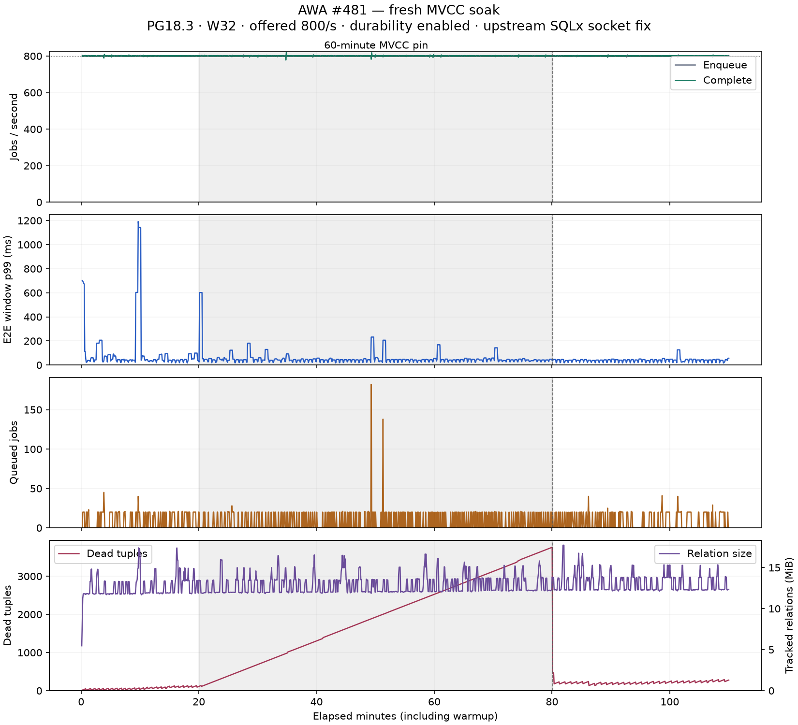

# AWA owner-reconciliation benchmark

Campaign status: **complete**. Started 2026-09-06T04:05:54.546726+00:00.

Baseline: `49b1a7741bc0ebdc805719bf3d0a51b4a17bba2d`. Candidate: `a8e7e638fd6ff715ff7be66318b6e8e3b109434e`.

Both builds use the same pinned upstream SQLx TCP_NODELAY fix. These results isolate #481 under corrected transport; they do **not** approve the unpatched crates.io SQLx 0.9.0 dependency. See the [direct COPY reproduction](../2026-09-06-sqlx-copy/SUMMARY.md). Exact executable hashes, driver sources, Cargo config, PG settings and container limits are in [campaign.json](campaign.json).

PostgreSQL 18.3, 4 CPU quota, 8 GiB memory limit, 256 MiB shared buffers; fsync, full_page_writes and synchronous_commit enabled. Fresh database per cell, ledger authority. One sequential pair per workload; run-to-run variability is not estimated.

## Reference and saturation

Reference: W32, offered 800/s, 60s warmup + 300s clean. Saturation: W64/128/256, depth target 4,000, offered-rate ceiling 50,000/s, 60s warmup + 180s clean. Pair order alternates. Rates are sampled every five seconds. Latency uses rolling 30-second windows sampled every five seconds; the latency column is the median of those p99 samples, not an aggregate job-level p99. Jobs use 256-byte nominal payloads and 1 ms simulated work. Completion rates and E2E latency are recorded at handler completion, before the database completion batch commits.

| Workload | Build | Enqueue/s | Complete/s | E2E p99 ms | Queue depth |
| --- | --- | ---: | ---: | ---: | ---: |
| ref800 | baseline | 800.0 | 800.0 | 21.0 | 0.0 |
| ref800 | candidate | 800.0 | 800.0 | 20.0 | 0.0 |
| sat-w64 | baseline | 4,701.1 | 4,678.4 | 894.0 | 3,072.0 |
| sat-w64 | candidate | 4,688.1 | 4,681.0 | 929.3 | 3,040.0 |
| sat-w128 | baseline | 7,638.6 | 7,657.7 | 617.2 | 2,432.0 |
| sat-w128 | candidate | 7,510.8 | 7,512.3 | 743.4 | 2,464.0 |
| sat-w256 | baseline | 10,422.8 | 10,435.2 | 460.2 | 1,779.0 |
| sat-w256 | candidate | 11,385.8 | 11,365.2 | 456.7 | 1,648.0 |

The initial W128 latency difference was checked with two additional pairs; see [all three W128 pairs](../2026-09-06-awa-481-w128-repeat/SUMMARY.md).

## Cron control-plane probe

Concurrent fleet publication, three steady rounds per cell. Manifests are prepared before timing, as in the runtime. Snapshot-only and publication measurements include waiting for the shared v045 protocol lock. The snapshot reference is not a v044 comparison and therefore does not isolate the cost of introducing that lock. These are control-plane timings, not throughput measurements; small-fleet tail estimates have few samples.

| Runtimes | Schedules | Snapshot p99 ms | Publish p99 ms | Reconcile ms | Retire ms |
| ---: | ---: | ---: | ---: | ---: | ---: |
| 1 | 10 | 7.0 | 4.0 | 2.9 | 2.9 |
| 1 | 1,000 | 6.0 | 3.0 | 7.9 | 9.0 |
| 1 | 10,000 | 7.9 | 3.9 | 53.9 | 60.1 |
| 10 | 10 | 31.5 | 31.0 | 4.0 | 2.9 |
| 10 | 1,000 | 29.1 | 30.1 | 8.0 | 9.0 |
| 10 | 10,000 | 29.4 | 30.9 | 53.0 | 78.1 |
| 100 | 10 | 323.1 | 328.7 | 5.0 | 3.9 |
| 100 | 1,000 | 296.3 | 308.9 | 10.1 | 10.9 |
| 100 | 10,000 | 300.3 | 299.7 | 66.0 | 74.0 |

## Fresh MVCC soak

Candidate W32 at offered 800/s: 10m warmup, 10m clean, 60m pinned transaction, 30m recovery. The discarded August 23 soak is not reused.

| Phase | Enqueue/s | Complete/s | E2E p99 ms | Queue depth | Peak dead tuples |
| --- | ---: | ---: | ---: | ---: | ---: |
| clean | 800.2 | 800.1 | 44.0 | 0.0 | 132.0 |
| pinned | 798.4 | 799.1 | 44.0 | 0.0 | 3,758.0 |
| recovery | 798.3 | 798.4 | 41.0 | 0.0 | 469.0 |

Time to ≤10% of pinned peak dead tuples: 15.0 seconds. Time to within 10% of clean median dead tuples: — seconds. Times use the first recovery sample as their origin; zero means the threshold was already met in that first sample. Sampling cadence is five seconds. A dash means the threshold was not observed; PostgreSQL tuple statistics are estimates.

## Evidence boundaries

This is a single-host, sequential performance experiment, not an exact job-loss proof. Correctness and released-artifact accounting evidence is linked from [AWA PR #482](https://github.com/hardbyte/awa/pull/482). Raw CSV and process logs remain local; checked-in manifests and summaries preserve the workload, build identity and phase aggregates.

The original soak process used the old `xmin_age_s` query, which omitted horizon holders with `backend_xid` but no `backend_xmin`. Pin validation therefore uses the original snapshot-horizon and idle-transaction-age samples, plus supplementary live SQL evidence; the raw legacy age values are retained. The reporting query is now corrected and tested. See [pin validation](pin-validation.json) and [live SQL samples](pin-verification.jsonl).
