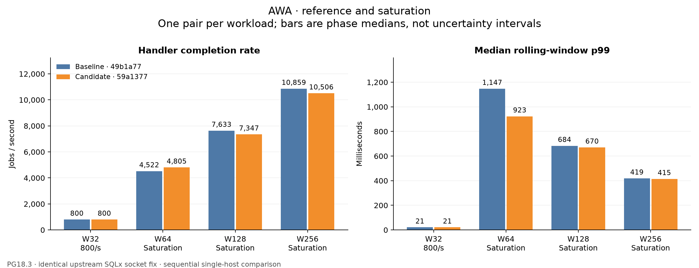
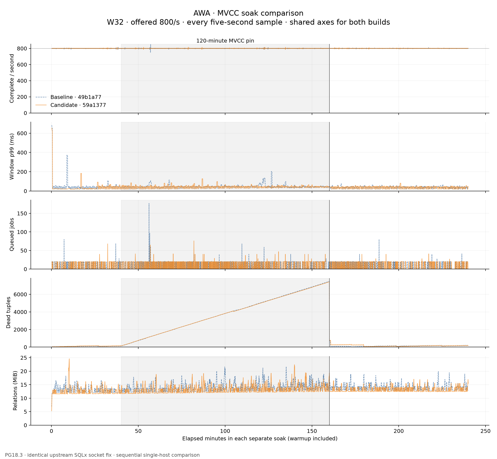
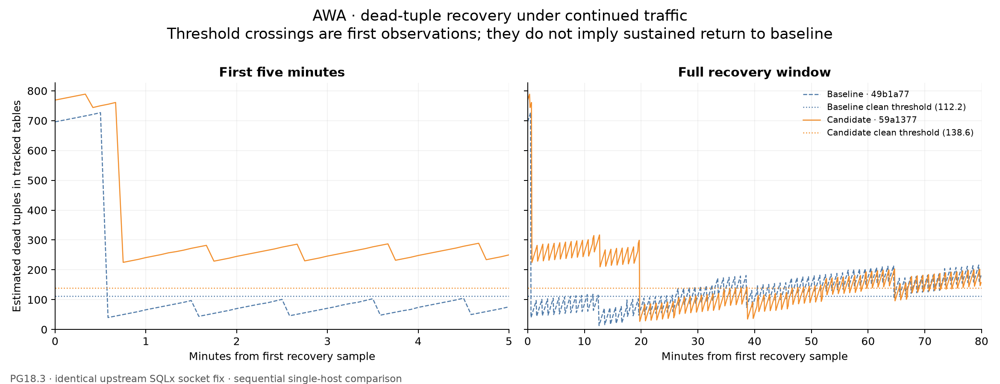
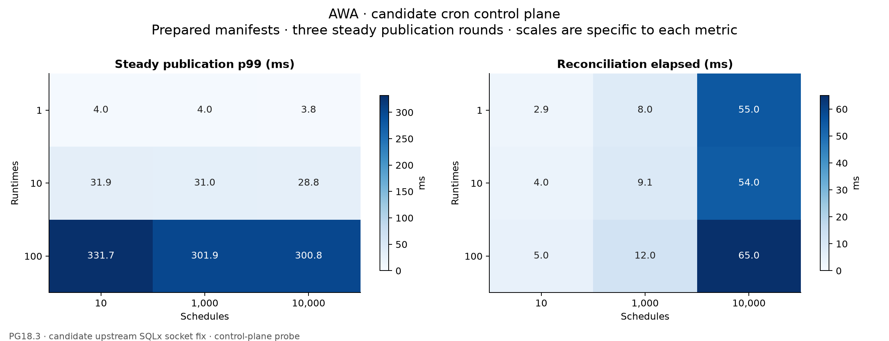

# AWA owner-reconciliation benchmark

[Interpretation, limitations and follow-ups](INTERPRETATION.md).

Campaign status: **complete**. Started 2026-09-06T10:23:42.909508+00:00; last update 2026-09-06T19:07:30.227634+00:00.

Baseline: `49b1a7741bc0ebdc805719bf3d0a51b4a17bba2d`. Candidate: `59a137735e112d834b4d9431f3b93c3f20cc295d`.

Both builds use the same pinned upstream SQLx TCP_NODELAY fix. These results isolate #481 under corrected transport; they do **not** approve the unpatched crates.io SQLx 0.9.0 dependency. See the [direct COPY reproduction](../2026-09-06-sqlx-copy/SUMMARY.md). Exact executable hashes, driver sources, Cargo config, PG settings and container limits are in [campaign.json](campaign.json).

PostgreSQL 18.3, 4 CPU quota, 8 GiB memory limit, 256 MiB shared buffers; fsync, full_page_writes and synchronous_commit enabled. Fresh database per cell, ledger authority. One sequential pair per workload; run-to-run variability is not estimated.

## Reference and saturation

Reference: W32, offered 800/s, 60s warmup + 300s clean. Saturation: W64/128/256, depth target 4,000, offered-rate ceiling 50,000/s, 60s warmup + 180s clean. Pair order alternates. Rates are sampled every five seconds. Latency uses rolling 30-second windows sampled every five seconds; the latency column is the median of those p99 samples, not an aggregate job-level p99. Jobs use 256-byte nominal payloads and 1 ms simulated work. Completion rates and E2E latency are recorded at handler completion, before the database completion batch commits.

| Workload | Build | Enqueue/s | Complete/s | E2E p99 ms | Queue depth |
| --- | --- | ---: | ---: | ---: | ---: |
| ref800 | baseline | 800.0 | 800.0 | 21.0 | 0.0 |
| ref800 | candidate | 799.9 | 800.0 | 21.0 | 0.0 |
| sat-w64 | baseline | 4,534.6 | 4,521.7 | 1,147.4 | 3,056.0 |
| sat-w64 | candidate | 4,803.6 | 4,804.6 | 923.1 | 3,024.0 |
| sat-w128 | baseline | 7,731.2 | 7,632.8 | 683.5 | 2,464.0 |
| sat-w128 | candidate | 7,321.3 | 7,347.4 | 670.2 | 2,512.0 |
| sat-w256 | baseline | 10,861.0 | 10,859.4 | 419.1 | 1,789.0 |
| sat-w256 | candidate | 10,544.8 | 10,505.9 | 414.7 | 1,696.0 |

## Cron control-plane probe

Concurrent fleet publication, three steady rounds per cell. Manifests are prepared before timing, as in the runtime. Snapshot-only and publication measurements include waiting for the shared v045 protocol lock. The snapshot reference is not a v044 comparison and therefore does not isolate the cost of introducing that lock. These are control-plane timings, not throughput measurements; small-fleet tail estimates have few samples.

| Runtimes | Schedules | Snapshot p99 ms | Publish p99 ms | Reconcile ms | Retire ms |
| ---: | ---: | ---: | ---: | ---: | ---: |
| 1 | 10 | 7.1 | 4.0 | 2.9 | 3.1 |
| 1 | 1,000 | 6.0 | 4.0 | 8.0 | 9.0 |
| 1 | 10,000 | 7.0 | 3.8 | 55.0 | 61.0 |
| 10 | 10 | 30.4 | 31.9 | 4.0 | 3.1 |
| 10 | 1,000 | 31.1 | 31.0 | 9.1 | 9.1 |
| 10 | 10,000 | 31.4 | 28.8 | 54.0 | 69.1 |
| 100 | 10 | 353.6 | 331.7 | 5.0 | 4.1 |
| 100 | 1,000 | 303.2 | 301.9 | 12.0 | 11.0 |
| 100 | 10,000 | 297.5 | 300.8 | 65.0 | 69.9 |

## Fresh MVCC soaks

W32 at offered 800/s, with fresh databases and the same phase lengths for each paired soak. Historical soaks are not reused.

### Baseline

10m warmup, 30m clean, 120m pinned, 80m recovery.

| Phase | Enqueue/s | Complete/s | E2E p99 ms | Queue depth | Peak dead tuples |
| --- | ---: | ---: | ---: | ---: | ---: |
| clean | 798.3 | 800.1 | 43.0 | 0.0 | 152.0 |
| pinned | 798.3 | 799.5 | 44.0 | 0.0 | 7,469.0 |
| recovery | 801.7 | 799.9 | 42.0 | 0.0 | 727.0 |

Time to ≤10% of pinned peak dead tuples: 0.0 seconds. Time to within 10% of clean median dead tuples: 35.0 seconds. Times use the first recovery sample as their origin; zero means the threshold was already met in that first sample. Sampling cadence is five seconds. A dash means the threshold was not observed; PostgreSQL tuple statistics are estimates.

Pin validation: **passed**. 1440 samples, maximum measured horizon age 7198.9s. [Validation evidence](mvcc-soak-baseline/pin-validation.json).

### Candidate

10m warmup, 30m clean, 120m pinned, 80m recovery.

| Phase | Enqueue/s | Complete/s | E2E p99 ms | Queue depth | Peak dead tuples |
| --- | ---: | ---: | ---: | ---: | ---: |
| clean | 801.7 | 800.1 | 25.0 | 0.0 | 178.0 |
| pinned | 798.3 | 799.7 | 46.0 | 0.0 | 7,413.0 |
| recovery | 801.7 | 800.1 | 43.0 | 0.0 | 789.0 |

Time to ≤10% of pinned peak dead tuples: 45.0 seconds. Time to within 10% of clean median dead tuples: 1,185.0 seconds. Times use the first recovery sample as their origin; zero means the threshold was already met in that first sample. Sampling cadence is five seconds. A dash means the threshold was not observed; PostgreSQL tuple statistics are estimates.

Pin validation: **passed**. 1440 samples, maximum measured horizon age 7199.0s. [Validation evidence](mvcc-soak-candidate/pin-validation.json).

## Reference and saturation

[Vector figure](plots/throughput-latency.svg).

## Matched soak traces

[Vector figure](plots/soak-comparison.svg).

## Recovery thresholds and full window

[Vector figure](plots/recovery.svg).

## Candidate control-plane cost

[Vector figure](plots/cron-protocol.svg).

Recovery thresholds report the first observed crossing, not sustained recovery. Continued traffic and estimated tuple statistics can cross the threshold again.

## Evidence boundaries

This is a single-host, sequential performance experiment, not an exact job-loss proof. Correctness and released-artifact accounting evidence is linked from [AWA PR #482](https://github.com/hardbyte/awa/pull/482). Raw CSV and process logs remain local; checked-in manifests and summaries preserve the workload, build identity and phase aggregates.
