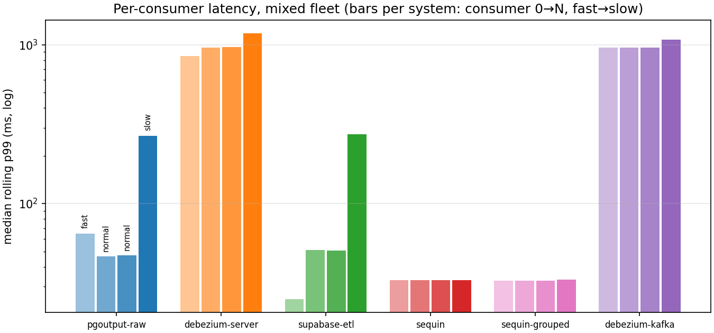
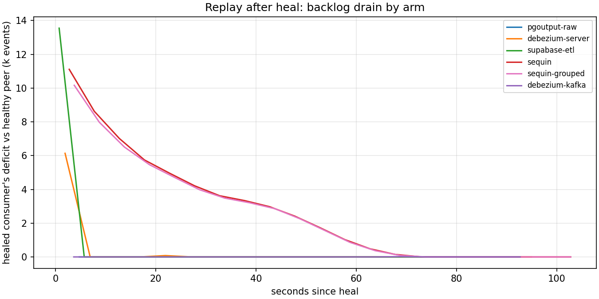

# CDC heterogeneous-profile sweep — mixed consumer speeds (2026-07-23)

First sweep with a realistic mixed consumer fleet: 6 systems × {fanout_steady, dead_consumer} in `events` mode at **150 events/s over `1xfast,2xnormal,1xslow`** (0 ms / 25 ms / 250 ms simulated handling per request), 5k-key keyspace, standard scaled durations (steady: 20 s warmup + 120 s clean; dead-consumer: + 90 s outage of consumer 1 (a normal profile) + 60 s heal + 30 s drain). This is the sweep the harness couldn't run before: Debezium Server's per-event-POST ceiling made non-fast profiles undrainable until HTTP-sink batching arrived in 3.6.0.Final (both Debezium arms run 3.6.0.Final from this sweep on; earlier sweeps ran 3.1.3).

All 12 cells **PASS: zero lost events on every consumer of every system**. Per-cell tables in `REPORT.md`.

## 1. Who pays for a slow consumer? (per-profile latency)

Clean-phase median rolling p99 per consumer, ms:

| system | fast | normal | normal | slow |
|---|---:|---:|---:|---:|
| pgoutput-raw | 65 | 46 | 47 | 267 |
| supabase-etl | 25 | 51 | 51 | 273 |
| sequin | 33 | 33 | 33 | **33** |
| sequin-grouped | 33 | 33 | 33 | **33** |
| debezium-server | 850 | 961 | 967 | 1181 |
| debezium-kafka | 957 | 957 | 958 | 1074 |

Two distinct insulation behaviours, and they are the mirror image of the WAL-retention story:

- **Slot-per-consumer and broker arms: each consumer wears its own speed.** The slow consumer's p99 sits at roughly one 250 ms handling cycle of queueing (267/273 ms on the light arms), while the fast consumer is untouched — 65 ms on pgoutput-raw and 25 ms on supabase-etl, essentially identical to the all-fast long sweep. Latency isolation between consumers holds.
- **Sequin's buffer absorbs the slow sink entirely: a flat 33 ms p99 for every profile, including slow.** The buffer delivers large batches per request, so a 250 ms-per-request sink still keeps arrival lag at buffer latency. In steady state the shared-slot buffer arm gives the *best* mixed-fleet latency — the same buffering that couples WAL retention to the slowest sink (§2) and replays slowly after an outage (§3).
- The JVM arms sit near ~1 s for every profile: capture-side cadence dominates and the consumer profile only nudges it. Batching moved debezium-server's throughput ceiling, not its latency floor — its ladder position is unchanged from the all-fast sweeps.

All consumers on all arms held the offered 150/s; no queue divergence anywhere.

## 2. The insulation matrix, per slot (90 s outage)

Peak retained WAL during the outage, per slot:

| Arm | Dead consumer's slot | Healthy consumers' slots | Elsewhere |
|---|---:|---:|---|
| pgoutput-raw / debezium-server / supabase-etl | 3.0–3.4 MB | 1.1–1.3 MB | — |
| sequin / sequin-grouped (one shared slot) | **40.9 / 46.3 MB** | (same slot) | own state-store WAL, same instance |
| debezium-kafka (one source slot) | 6.1 MB (flat) | (same slot) | Kafka offset lag **13,372**, entirely on the dead consumer's group |

Same shape as the all-fast long sweep, now with per-slot attribution: the dead consumer's slot pins ~2.5× a healthy slot and nothing else moves; Sequin's shared slot pins ~13× the dead slot of the per-slot arms; the broker arm's backlog is offset lag isolated to the dead consumer's group (the healthy groups read 0, and the slow consumer trails by all of 76 records).

## 3. Replay asymmetry persists at small scale

Healed-consumer catch-up to a healthy peer after the 90 s outage (~13.5k-event backlog):

| Arm | Peak replay | Catch-up |
|---|---:|---:|
| pgoutput-raw | 2.8k/s | ≤5 s |
| debezium-kafka | 2.8k/s | ≤5 s |
| supabase-etl | 2.9k/s | ~5 s |
| debezium-server | 1.5k/s | ~5 s |
| sequin | 648/s | **~70 s** (past the 60 s heal, into drain) |
| sequin-grouped | 786/s | **~70 s** |

Same ordering as the 15-minute-outage long sweep: slot and broker arms replay in seconds, Sequin's buffer replays at a fraction of the others' rate and outlives the heal phase. The healed Sequin consumer again replayed with ~3.9k out-of-order redeliveries (both variants); zero duplicates and zero reordering on every other arm.

## 4. Heal-phase p99 now measures backlog age

First sweep with the receiver histogram's 2 h ceiling: peak heal p99 lands at ~90 s for the slot/broker arms (≈ the outage duration — the oldest replayed event) and ~140 s for Sequin, which is exactly its slower replay showing up as older events at delivery. This column is now a usable recovery metric rather than the saturated artifact of the previous sweep.

## Caveats

- Standard scaled durations (~1/8 of full), single run per cell, one host.
- The receiver's simulated handling delay is per *request*; batched sinks amortize it over the batch. "Slow consumer" therefore models a slow request handler (real: a slow downstream API), not a fixed per-event cost.
- Debezium arms moved to 3.6.0.Final this sweep (server batching enabled, `snapshot.mode` never→no_data); earlier sweeps ran 3.1.3.Final — cross-sweep Debezium comparisons carry that version change.
