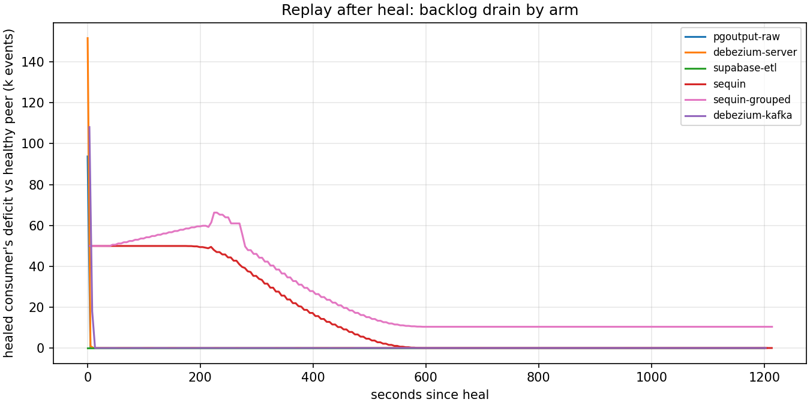
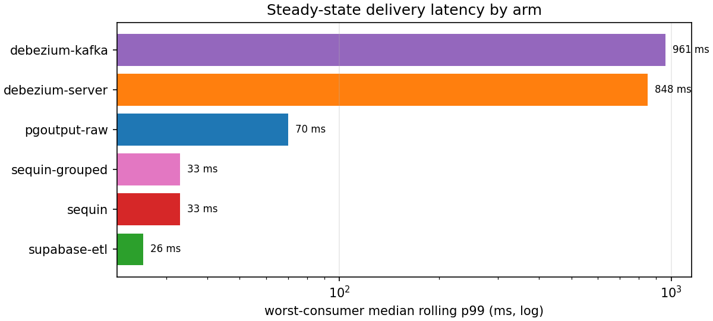

# CDC long sweep — all six arms at full scale (2026-07-22)

Full-scale run of the CDC harness: 6 systems × {fanout_steady, dead_consumer} in `events` mode at **200 events/s over 4 fast-profile consumers**, 20k-key keyspace (steady: 2m warmup + 15m clean; dead-consumer: 2m warmup + 5m clean + **15m outage** of consumer 1 + 15m heal + 5m drain). ~7.5h wall clock, one run per cell. Per-cell tables in `REPORT.md`; raw samples live in each run dir (not committed — regenerate with the `manifest.json` CLI).

All 12 cells **pass ledger verification: zero lost events on every consumer of every system**, including through the 15-minute outage.

## 1. Where a 15-minute outage's backlog lives

Same workload, same outage, three different places the backlog physically lands:

| Arm | Topology | Source slot WAL (clean → dead peak) | Other backlog location |
|---|---|---:|---|
| pgoutput-raw / debezium-server / supabase-etl | slot-per-consumer | ~3–6 MB → **~57 MB** | none — the dead consumer's own slot pins it |
| sequin / sequin-grouped | shared slot + buffer | ~6.5 MB → **642–680 MB** | its own Postgres state store (same instance) |
| debezium-kafka | broker | 9.8 MB → **11.0 MB (flat)** | Kafka consumer-group offset lag: **179,239 records** |

The slot-per-consumer arms isolate cleanly: healthy consumers' slots keep advancing and the retained WAL is exactly the dead slot's 15 minutes of change stream (~57 MB at this rate). The broker arm is the textbook decoupling result — the source slot stays flat because Connect keeps committing as it writes to Kafka, and the backlog becomes offset lag on the broker. Sequin's shared slot is the anti-pattern under this failure: retention grew to ~11× the slot-per-consumer arms. Attribution nuance: Sequin's own message-store writes live on the same Postgres instance, so its retained-WAL figure includes the WAL its own buffering generates — that amplification is a real cost of the shared-instance deployment, but a sidecar-DB deployment would show a smaller number.

## 2. Replay asymmetry after heal

The outage backlog is ~180k events. Time for the healed consumer to reach parity with a healthy one, measured from delivery totals:

| Arm | Peak replay rate | Catch-up time |
|---|---:|---:|
| supabase-etl | 36k/s | <5 s |
| debezium-server | 30k/s | ~5 s |
| pgoutput-raw | 19k/s | ~5 s |
| debezium-kafka | 18k/s | ~10 s |
| sequin | 14k/s peak | **~530 s** |
| sequin-grouped | 15k/s peak | **>20 m** (reached parity only during the post-run drain wait) |

Slot- and broker-based arms replay a 15-minute backlog in seconds — the bottleneck is just decode+HTTP throughput. Sequin's buffer replays at a sustained effective ~340/s (bursty; peak is comparable to the others but not sustained), so recovery takes minutes, and enabling `message_grouping` makes it slower still. If recovery-time-to-parity matters, this is the sharpest differentiator in the lineup.

## 3. Steady-state ladder

Clean-phase worst-consumer median rolling p99: **supabase-etl 26 ms < sequin 33 ms < pgoutput-raw 70 ms < debezium-server ~850 ms < debezium-kafka ~960 ms**. All arms held the 200/s offered rate with no drift over 15 minutes. Memory tells the deployment-weight story: supabase-etl 13 MB and pgoutput-raw 60 MB (single Rust/Python processes) vs Sequin ~600 MB (Elixir + Redis) vs the JVM arms 1.4–1.7 GB (four Debezium Server JVMs, or Kafka + Connect + bridge).

## 4. Correctness across the outage

Zero loss everywhere. The healed Sequin consumer replayed with **~20.5k out-of-order redeliveries** (both variants — `message_grouping` did not change recovery reordering in v0.14.6); every other arm recovered with zero duplicates and zero reordering. At-least-once holds for all six arms; ordering through recovery only holds for the slot-per-consumer and broker arms.

## 5. Broker insulation shifts the failure, it doesn't remove it

A Kafka consumer that stalls in downstream retry without polling for longer than `max.poll.interval.ms` (default 5 minutes) is evicted from its consumer group, and its next offset commit fails with `CommitFailedError`. A 15-minute sink outage crosses that threshold, so the harness bridge sets `max_poll_interval_ms=2h` to keep modelling a blocked-in-retry consumer. The operational point for real deployments: the broker arm converts "source WAL grows" into "consumer group churns" — a naive consumer that blocks in downstream retry gets evicted mid-outage and loses its offset commit, so the insulation layer moves the failure domain rather than eliminating it.

## Caveats

- Single run per cell, one host, fast-profile consumers only (debezium-server's per-event POST ceiling makes heterogeneous profiles incomparable — see `docs/cdc-sut-notes.md`).
- Ignore the `peak rolling p99 (heal)` column in this run's REPORT.md: replayed events older than the receiver histogram's ~67 s ceiling were dropped, so every system saturates at ~66.4 s. Use the catch-up table (§2) for recovery comparisons. The ceiling is 2 h for subsequent runs.
- Sequin's retained-WAL figure includes its own state-store WAL (shared instance), per the design's "cost to the source instance" framing.
- `events` mode only; the ledger/outbox consistency cells ran at smoke scale in `results/cdc-sweep-ledger/`.
